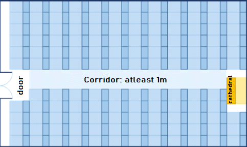

# Chapter 2.2. Simple calculations - Exam Problems

In the previous chapter, we got familiar with the system console and how to work with it – how to **read numbers** from the console and how to **print an output** on the console. We went through the main arithmetical operations and briefly mentioned data types. In this chapter we will practice and consolidate what we have learned so far, by solving a few **more complicated problems**, given .


## Reading Numbers from the Console

Before jumping into the practical problems, we are going to revise the most important aspects of what we have studied in the previous chapter. We will start with reading numbers from the console.

### Reading an Integer

We need to create a variable to store the numbers (for example **`num`**), and to use the standard command to read data from the console in combination with the function **`Integer.parseInt(…)`**, which converts text into number:

```java
int num = Integer.parseInt(scanner.nextLine());
```

### Reading a Floating-Point Number

We read a floating-point number the same way we read an integer, but this time we use the function **`double.parseDouble(…)`**:

```java
double num = Double.parseDouble(scanner.nextLine());
```

## Printing text through formatted specificators (format specifiers)

**Format specifier** is an expression which is going to be replaced with a particular value while printing the output. The method **`System.out.printf(…)`** supports printing a string based on a formatted specificators, where the first argument, which we need to pass, is the formatted string, followed by the number of arguments, equal to the number of specificators.

```java
System.out.printf("You are %s %s, a %d-years old person from %s.",
  firstName, lastName, age, town);
```

## Arithmetic Operators

Let's revise the main arithmetic operators for simple calculations.

### Operator +

```java
int result = 3 + 5; // резултатът е 8
```

### Operator -

```java
int result = 3 - 5; // резултатът е -2
```

### Operator *

```java
int result = 3 * 5; // резултатът е 15
```

### Operator /

```java
int result = 7 / 3; // резултатът е 2 (целочислено деление)
double result2 = 5 / 2.0; // резултатът е 2.5 (дробно деление)
```

## Concatenation

By using the operator **`+`** between string variables (or between a string and a number), we have the so-called concatenation (cobining strings).

```java
String firstName = "Ivan";
String lastName = "Ivanov";
int age = 19;
String str = firstName + " " + lastName + " is " + age + " years old";
// Ivan Ivanov is 19 years old
```

## Exam Problems

Now, after we revised how to make simple calculations and how to read and print numbers from the console, let's move to the tasks. We will solve a few **problems from a SoftUni entrance exam**.

## Problem: Training Lab

**A training lab** has a rectangular size **l** for **w** metres, without columns on the inside. The hall is divided into two parts- left and right, with a hallway - approximately in the middle. In both parts, there are **rows with desks**. In the back of the hall, there is a big **entrance door**. In the front, there is a **department** with podium for the lecturer. A single **working place** occupies **70 x 120 cm** (a table with size 70 x 40 cm + space for a chair with size 70 x 80 cm). **The hallway** width is at least **100 cm**. It is calculated that due to the **entrance door** (which has an opening of 160cm) **exactly one working space is lost**, and due to the **department** (кwhich has size of 160 x 120 cm) are lost exactly **2 working places**. Write a program that reads the size of the training lab as input parameters and calculates the **number of working places in it** at the described location (look at the figure).

### Input Data

Are read from the console **2 numbers**, one per line: **l** (length in meters) and **w** (width in meters).

Constraints: **3 ≤ w ≤ l ≤ 100**.

### Output Data

Print on the console one integer number: **the number of working places** in the training lab.

### Sample Input and Output

| Вход   | Изход | Чертеж |
|---------|-------|--------|
|15<br>8.9  |129  |        | 
|8.4<br>5.2 |39    |         |

#### Clarification of the Examples

In the first example, the hall length is 1500 cm. There could be located **12 rows** (12 \* 120 cm = 1440 + 60 cm residue). The hall width is 890 cm. From them 100 cm are for the hallway in the middle. In the rest 790 cm could be located **11 desks per row** (11 \* 70 cm = 770 cm + 20 cm residue). **Number of places = 12 * 11 - 3** = 132 - 3 = **129** (we have 12 rows with 11 working places = 132 minus 3 places for podium and entrance door).

In the second example, the hall length is 840 cm. There could be located **7 rows** (7 \* 120 cm = 840, without residue). The hall width is 520 cm. From them 100 cm are for the hallway in the middle. In the rest 420 cm could be located **6 desks per row** (6 \* 70 cm = 420 cm, without residue). **Number of places = 7 * 6 - 3** = 42 - 3 = **39** (We have 7 rows with 6 working places per row = 42 minus 3 laces for podium and entrance door).

### Hints and Guidelines

Try to solve the problem on your own first. If you do not succeed, go through the hints.

#### Idea for Solution

As with any programming task is **important to build an idea for its solution**, before we start to write code. Let's carefully go through the problem requirements. We have to write a program that calculates the number of working places in a training lab, where the number depends on the hall length and height. We notice that the provided input will be in **meters**, and the information about how much space the working places and hallway take, will be in **centimeters**. To do the calculations, we will use the same measuring units, no matter whether we choose to convert length and height into centimeters or the other data in meters. The first option is used for the presented solution.  

Next, we have to calculate **how many columns and how many rows** with desks will fit. We can calculate the columns by **subtracting the width by the necessary space for the hallway (100 cm)** and **divide the difference by 70 cm** (the length of a working place). We will find the rows by dividing the **length by 120 cm**. In both operations with integer and fractional part can be obtained, **In a variable we should store only the integer part**. In the end, we multiply the number of rows by the number of columns and divide it by 3 (the places which are lost because of the entrance door and podium). This is how we calculate the needed value. 

#### Choosing Data Types

From the example, we see that a real number with whole and fractional part can be given as an input, therefore, it is not appropriate to choose data type **`int`**, This is why we use **`double`**. Choosing data type for the next variables depends on the method we choose to solve the problem. . As with any programming task, this one also has **more than one way to be solved**. Two methods will be shown here. 

#### Solution

It is time to go to the solution. We can divide it into three smaller tasks: 
* **Reading** an input.
* **Doing** the calculations.
* **Printing** the output on the console.

The first thing we have to do is read the input from the console. With **`scanner.nextLine()`** we read the values from the console and with the function **`Double.parseDouble(…)`** we convert the string (text) value into **`double`**. 


Let’s move to the calculations. The special part here is that after dividing the numbers, we have to store only the integer part the result in a variable. 

<table><tr><td></td>
<td><b>Търсете в Google!</b> Whenever we have an idea how to solve a particular problem, but we do not know how to write it in Java or we are dealing with one that we assume that many other people have had before us, the easiest way to solve it is by looking for information on the Internet.</td>
</tr></table>

In this case, we can try with the following search: *java get whole number part of double*. We find out that, one possible way is to use the method **`Math.floor(…)`**. as it works with data types of type **`double`**, For the number of rows and columns we create variables of the same type.  


Second variant: As we already know, the operator for division **`/`** operates differently on integers and decimals. **When dividing integer with integer** (for example **`int`**), **the result is also an integer**. Therefore, we can search how to convert the real numbers that we have as values for the height and the width, into integers and then divide them. 

In this case, there could be  **data loss**, after having removed the fractional part, so it is necessary that it is converted **expressly** (explicit typecasting). We use the operator for converting data **`(type)`**, by replacing the word **type** with the needed **тdata type** and place it **before the variable**. More for converting data types you can find out in the book ["Въведение в програмирането с Java", стр. 119-123](http://www.introprogramming.info/intro-java-book/read-online/glava3-operatori-i-izrazi/#_Toc243587227).


With **`System.out.println(…)`** we print the result on the console.


### Testing in the Judge System

Test your solution here: [https://judge.softuni.bg/Contests/Practice/Index/650#0](https://judge.softuni.bg/Contests/Practice/Index/650#0).


## Problem: Vegetable Market

A gardener is selling his harvest on the vegetables market. He is selling **vegetables for N levs per kg** andи **fruits for M levs per kg**. Write a program that **дcalculates the earnings of the harvest in Euro** (As we assume that **one euro** is equals to **1.94 лв.**).

### Input Data

They are read from the console **4 numbers**, one per line:
* First line – vegetables price per kilogram – a floating-point number.
* Second line – fruit price per kilogram – a floating-point number.
* Third line – : total kilograms of vegetables – an integer.
* Fourth line – total kilograms of fruits – an integer.

**Constraints**: all numbers will be in the range of **0.00** to **1000.00**.

### Output Data

Print on the console **one floating-point number: the earnings of all fruits and vegetables in Euro**.

### Sample Input and Output

| Вход   | Изход  | Вход    | Изход      |
|-----------|----------|-----------|----------------|
|0.194<br>19.4<br>10<br>10|101 | 1.5<br>2.5<br>10<br>10|20.6185567010309| 

**Clarifications for the first example:**

* Vegetables cost: 0.194 lv. \* 10 kg. = **1.94 lv.**
* Fruits cost: 19.4 lv. \* 10 kg.  = **194 lv.**
* Total: **195.94 lv. = 101 euro**. 


### Hints and Guidelines

First, we will give a few ideas and particular hints for solving the problem, followed by the essential part of the code.

#### Idea for Solution

Let's first go through the problem requirements. In this case, we have to calculate the **total income** from the harvest. It is equal to the **sum of the earnings from the fruits and vegetables**, which we can calculate by multiplying **the price per kilogram by the quantity**. The input is given in leva and the output should be in EUR. It is assumed that 1 Euro equals 1.94lv,therefore, in order to get the wanted **output value, we have to divide the sum by 1.94**.

#### Choosing Data Types

After we have a clear idea of how to solve the task, we can continue with choosing appropriate data types. Let's go through the **input**: we have **two integers** for total kilograms of vegetables and fruits, therefore, the variables we declare to store their values will be of **`int`**. The prices of the fruits and vegetables are said to be **floating-point numbers**, so the variables will be of type **`double`**.

We can also declare two variables to store the income from the fruits and vegetables separately. . As we are multiplying a variable of type **`int`** (total kilograms) with one of type **`double`** (price), the result should also be of type **`double`**. Let's clarify that: generally **operators work with arguments of the same type**. Therefore, in order to multiply values of different data types, we have to convert them into the same type. When there are types of different scopes in one expression, the one with the highest scope is the one the other types are converted to, in this case **`double`**. . As there isn't danger of data loss, **the conversion is implicit** (implicit) and is automatically done by the compiler.  

The **output** should also be a **floating-point number**, this means that the result will be stored in a variable of type **`double`**.

#### Solution 

It is time to get to the solution. We can divide it into three smaller tasks: 
* **Reading** the input.
* **Doing** the calculations.
* **Printing** the output on the console.

In order to read the input, we declare variables, which we have to name carefully, so that they can give us a hint about the values they store. With **`scanner.nextLine()`** we read values from the console and with the functions **`Integer.parseInt(…)`** and **`Double.parseDouble(…)`** we convert the particular string value into **`int`** and **`double`**.


We do the necessary calculations: 


The task does not specify special output format, so we just have to calculate the requested value and print it on the console. As in mathematics and so in programming, division has a priority over addition. However, in this task, first we have to **calculate the sum** of the two input values and then we have to **divide by 1.94**. In order to give priority to addition, we can use brackets. With **`System.out.println(…)`** we print the output on the console.  


### Testing in the Judge System

Test your solution here: [https://judge.softuni.bg/Contests/Practice/Index/650#1](https://judge.softuni.bg/Contests/Practice/Index/650#1).


## Problem: Change Tiles

The tiles on the ground in front of an apartment building need changing. The ground has a **square shape with side of N meters**. The tiles are **wide W meters** and **length L meters**. There is one bench on the ground with **width of "M" meters and length of "O" meters**. The tiles under it do not need to be replaced. Each tile is replaced for **0.2 minutes**.

Write a program that reads the size of the ground, the tiles and the bench from the console, and calculates **how many tiles are needed to** cover the ground and calculates **is the total time for replacing the tiles**.

**Example**: **ground** with size 20 м. mm has area of 400 кв.м. **A bench**, that is 1 м. wide and 2 м. long, has area of 2 кв.м. One **tile** is 5 м. wide and 4 м. long and has area of = 20 кв.м. **The area**, that needs to be covered is **400 - 2 = 398 кв.м.** They are needed **398 / 20 = 19.90 tiles**. The needed **time** is **19.90 * 0.2 = 3.98 minutes.**

### Input Data

They are read from the console **5 numbers**:

* **N – length** of a **side** of the ground within the range of [**1 … 100**].
* **W – width** per **tile** in the range of [**0.1 … 10.00**].
* **L – length** per **tile** in the range of [**0.1 … 10.00**].
* **М – width** of the **bench** in the range of [**0 … 10**].
* **О – length** of the **bench** in the range of [**0 … 10**].

### Output Data

Print on the console **two numbers**: **number of tiles**, needed for the repair, and **the time for placing them**, each on a new line.

## Sample Input and Output

| Вход        | Изход    | Вход    | Изход            |
|---------------|------------|-----------|--------------------|
|20<br>5<br>4<br>1<br>2|19.9<br>3.98| 40<br>0.8<br>0.6<br>3<br>5|3302.08333333333<br>660.416666666667| 

**Explanation of the example:**

* **total area** = 20 \* 20 = 400.
* **area of the bench** = 1 \* 2 = 2.
* **are for replacing** = 400 – 2 = 398.
* **area of the tiles** = 5 \* 4 = 20.
* **needed tiles** = 398 / 20 = 19.9.
* **needed time** = 19.9 \* 0.2 = 3.98.

### Hints and Guidelines

Let's make a draft to clarify the task requirements. It can look the following way:


### Idea for Solution

It is required to calculate **the number of tiles**, which have to be placed, as well as the **time**, for replacing them. In order to **calculate the number of tiles**, we have to calculate the **area that needs to be covered**, and to **divide it by the area per tile**. The ground is square, therefore, we find the total area by multiplying its side by its value **`N * N`**. After that, we calculate **the area that the bench takes up**, by multiplying its two sides as well **`M * O`**. After subtracting the area of the bench from the area of the whole ground, we obtain the area that needs to be repaired. 

We calculate the area of a single tile by **multiplying** its two sides with one another - **`W * L`**. As we already saied, now we have to **divide** the area for covering by the area of a single tile. This way, we find the number of necessary tiles which we multiply by **0.2** (the time needed for changing single tile). Now, we have the wanted output. 

### Choosing Data Types

ДThe length of the side of the ground, the width and the length of the bench, will be given as **integer numbers**, therefore, in order to store their values, we can declare **variables of type `int`**. We will be given floating-point numbers for the width and the length of the tiles and this is why we will use **`double`**. The output will be a floating-point number as well, so the variables will be of type **`double`**. 

### Solution

As in the previous tasks, we can divide the solution into three smaller tasks:
* **Reading** the input.
* **Doing** the calculations.
* **Printing** the input on the console.

The first thing we have to do is go through **the input** of the task. It is important to pay attention to the sequence they are given in. With **`scanner.nextLine()`** we read values from the console and with **`Integer.parseInt(…)`** and **`Double.ParseInt(…)`** we convert the particular string value into **`int`** and **`double`**.


After we have initialized the variables and have stored the corresponding values in them, we move to the **calculations**. As the values of the variables **`n`**, **`a`** and **`b`**, which we work with, are stored in variables of type **`int`**, we can also declare for the results **variables of the same type**.  


The variables **`w`** and  **`h`** are of type **`double`**, therefore, for the **area of a single tile** we create a variable of the same type. Finally **we calculate the values that we have to print** on the console. **The number** of needed **tiles** we get by **dividing the area that needs to be covered by the area of a single tile**. When dividing two numbers, one of which is **floating-point number**, the result is also a **floating-point number**. In order, for the calculations to be correct, we store the result in a variable of type **`double`**. The task does not specify special formatting or rounding of the output, so we just print the values with **`System.out.println(…)`**. 


### Testing in the Judge System

Test your solution here: [https://judge.softuni.bg/Contests/Practice/Index/650#2](https://judge.softuni.bg/Contests/Practice/Index/650#2).


## Problem: Money

Some time ago **Pesho bought bitcoins**. He will now go on a trip aroung Europe **and he will need euro**. Besides bitcoins, he has and **Chinese yuan**. Pesho wants **to exchange his money in euro** for the excursion. Write a program, which **calculates how much euro** he can buy depending on the following rates:

* **1 Bitcoin = 1168 leva.**
* **1 Chinese yuan = 0.15 dollars.**
* **1 dollar = 1.76 leva.**
* **1 euro = 1.95 leva.**

The exchange office has **commission fee within 0 to 5 percent from the final sum in Euro**.

### Input Data

Three numbers are read from the console:
* On the first line – **number of Bitcoins**. Integer in the range of [**0 … 20**].
* On the second line – **number of Chinese yuan**. Floating-point number in the range of [**0.00 … 50 000.00**].
* On the third line – **comission fee**. Floating-point number in the range of [**0.00 … 5.00**].

### Output Data
Print one number on the console - **– the result of the exchange of currencies**. Rounding is not necessary.

### Sample Input and Output

| Вход        | Изход    |Вход        | Изход            | Вход         | Изход            |
|---------------|------------|------------|------------------|--------------|------------------|
|1<br>5<br>5|569.668717948718| 20<br>5678<br>2.4|12442.2442010256|7<br>50200.12<br>3|10659.4701177436|

**Explanation**: 
* 1 Bitcoin = 1168 leva
* 5 yuan = 0.75 dollars.
* •	0.75 dollars = 1.32 leva
* **1168 + 1.32 = 1169.32 leva =599.651282051282 Euro**
* **•	Commission fee:** 5% of 599.651282051282 = **29.9825641025641** 
* **Result**: 599.651282051282 - 29.9825641025641 = **569.668717948718 Euro**

### Hints and Guidelines

Let's first think of the way we can solve the task again, before having started to write code.

#### Idea for Solution

ВWe see that the **number of bitcoins** and **the number of Chinese yuans** will be given in the input. **The output** should be in **euro**. The exchange rates that we have to work with are specified in the task. We notice that we can only exchange the sum in BGN to EUR so we have **first to calculate the whole sum that Peter has in BGN**, and **then to calculate the output**. 

As we have information for the exchange rate of Bitcoins to BGN, we can directly exchange them. On the other hand, in order to get the value of **Chinese yuans in leva**, first we have to **exchange them in dollars**, and then **the dollars to BGN**. Finally, we will **sum the two values** and calculate how much Euro that is. 

Only the final step left: to **calculate the commission fee** and subtracting the new sum from the total one. The comission will be given as a **floating-point number**, which will represent a **percent from the total sum**. Let's divide it from the beginning by 100, so as to calculate its **percentage value**. We will multiply it by the sum in Euro and than divide the result from the same sum and print the final sum on the console. 

#### Choosing Data Types

**Bitcoins** are given as **an integer**, therefore, for their value we can declare **a variable of type `int`**. As a number **Chinese yuan and commission fee** we will obtain **a floating-point number**, so we are going to use **`double`**. As **`double`** is the data type with bigger scope, and the **output** should also be a **floating-point numbe**, we will use it for the other variables we create as well. 

#### Solution

After we have built an idea on how to solve the task and we have chosen the data structures that we are going to use, it is time to get to **write the code**. As in the previous tasks, we can divide the solution into three smaller tasks: 
* **Reading** the input.
* **Doing** the calculations.
* **Printing** the input on the console.

**We declare the variables**, that we are going to use and again we carefully have to choose **meaningful names**, which are going to give us hints about the values they store. We initialize their values: with **`scanner.nextLine()`** we read the input numbers from the console and convert the string entered by the user to **`int`** or **`double`**. 


We do the necessary calculations: 


Finally, we **calculate the commission fee value** and **subtract it from the sum in Euro**. Let's pay attention to the way we could write this: **`euro -= commission * euro`** is the short way to write **`euro = euro - (commission * euro)`**. In this case, we use a **combined assignment operator** **`-=`**, which **subtracts the value of the operand to the right from the one to the left**. The operator for multiplication **`*`** has **a higher priority** than the combined operator, this is why, the expression **`commission * euro`** is performed first and then its value is divided. More about the operators you can learn in the book ["Въведение в програмирането с Java", (стр. 116)](http://www.introprogramming.info/intro-csharp-book/read-online/glava3-operatori-i-izrazi/#_Toc298863965).

The task does not specify special string formatting or rounding the result, therefore, we just have to calculate the output and print it on the console. 


Let's pay attention to something that applies to all other problems of this type: written like that, the solution of the task is pretty detailed. As the task itself is not too complex, in theory, we could write one big expression, where right after having taken the input, we calculate the output. For example, such expression would look like this: 


This code would print a correct result, but it is **hard to read**. It won't be easy to find out how it works and whether if it contains any mistakes, as well as finding such and correcting them. It is better to **Instead of one complex expression, to write a few simpler ones** and to store their values in variables with appropriate names. This way, the code is cleaner and easily maintainable. 

## Testing in the Judge System

Test your solution here: [https://judge.softuni.bg/Contests/Practice/Index/650#3](https://judge.softuni.bg/Contests/Practice/Index/650#3).


## Problem: Daily Earnings

Ivan is a programmer in an **American company** and he works from home **approximately N days per month**, and earns **approximately M dollars per day**. At the end of the year, Ivan **пgets bonus**, which is **equals to 2.5 monthly salaries**. From what he earned during the year **withhold 25% for taxes**. Write a program that **calculates what is the amount of Ivan's net average earnings** in leva per day, as he spends them in Bulgaria. It is accepted that one year has exactly **365 days**. **The exchange rate of dollar** to leva will be **read from the console**.

### Input Data

They are read from the console **3 numbers**: 
* On the first line – **working days in the month**. Integer in the range of [**5 … 30**].
* On the second line – **earned money per day**. Floating-point number in the range of [**10.00 … 2000.00**].
* On the third line – **exchange rate to leva** /1 dollar = X leva/. Floating-point number in the range of [**0.99 … 1.99**].

### Output Data

On the console **to print 1 number – approximately daily earnings in leva**. The result should be **rounded up to the second digit after the decimal point**.

### Sample Input and Output

| Вход        | Изход          |Вход        | Изход            | Вход         | Изход    |
|---------------|------------------|-------------|------------------|-------------|------------------|
|21<br>75.00<br>1.59|74.61| 15<br>105<br>1.71|80.24|22<br>199.99<br>1.50|196.63|

**Explanation**:
* **1 monthly salary** = 21 \* 75 = 1575 dollars.
* **Annual income** = 1575 \* 12 + 1575 \* 2.5 = 22837.5 dollars.
* **Taxes** = 25% от 22837.5 = 5709.375 leva.
* **Net annual income** = 17128.125 dollars = 27233.71875 leva.
* **Average earning per day** = 27233.71875 / 365 = 74.61 leva.

### Hints and Guidelines

Firstly, we have to analyze the task and think of a way to solve it. Then, we will choose data types and, finally, we will write the code.

#### Idea for Solution

Let's first calculate **how much the monthly salary** of Ivan is. . We do that by **multiplying the working days per month by his daily earnings**. **We multiply the result** by 12, so as to calculate his salary for 12 months, and then **by 2.5**, in order to calculate the bonus. After having summed up the two values, we calculate his **annual income**. From it **we have to reduce 25% for taxes**. We can do this by multipling his total income by **0.25** and subtract the result from it. Depending on the exchange rate, we **exchange the dollars to leva**, after that **we divide the result by the days in a year**, which we accepts that they are 365.     

#### Choosing Data Types

**The working days per month** are given as an **integer**, therefore, we can declare a variable of **type `int`**. For the **earned money**, as well as for the **exchange rate of dollar to leva**, we will obtain **a floating-point number**, so we use for them **`double`**. As **`double`** is the type with **the higher scope**, and the output should also be **a floating-point number**, we use double for the other variables that we create as well. 

#### Solution

Again: after we have an idea on how to solve the problem and we have considered the data types that we are going to use, we can start **writing the program**. As in the previous tasks, we can divide the solution into three smaller tasks: 
* **Reading the input**.
* **Doing the calculations**.
* **Printing the output** on the console.

**We declare the variables**, that we are going to use by trying to choose **meaningful names**. With **`scanner.nextLine()`** we read the input numbers from the console and we **convert** the input string to **`int`** or **`double`** with **`Integer/Double.parseInt/Double(…)`**. 


Doing the Calculations: 


We could write an expression that calculates the annual income without brackets as well. As multiplication is an operation that has a higher priority over addition, it will be performed first. Despite that, **writing brackets is recommended when using more operators**, because this way the code becomes **more easily readable** and chances of making a mistake are smaller. 

Finally, we have to print the result on the console. We notice that **the number has to be rounded up to the second digit after the decimal point**. For this purpose we can use **formatted specificators**, an item that will be replaced by a particular value when printing. In Java for **formatting specificator** is used `%`, followed by a specific letter (specificator). We can format an integer or a floating-point number by using **F**/**f**, or **D**/**d**. It is followed by a whole positive number, specifying the number of digits after the decimal point (you can read more about formatting in the book ["Въведение в програмирането с Java" (стр. 137-143)](http://www.introprogramming.info/intro-java-book/read-online/glava4-vhod-i-izhod-ot-konzolata/#_Toc243587243).

We see the final result like this:


### Testing in the Judge system

Test your solution here: [https://judge.softuni.bg/Contests/Practice/Index/650#4](https://judge.softuni.bg/Contests/Practice/Index/650#4).
