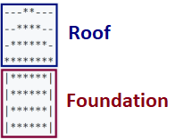

# Chapter 6.1 Nested Loops

This chapter will discuss **nested loops in the Java language**. We will use **`for`** loops to **draw** different **figures** containing symbols and signs arranged in rows and columns **on the console**. We will use **`single` loops** and **nested loops** (loop statement inside another loop statement), **calculations** and **checks**, to print on the console simple and not so simple figures in given sizes.

## Video

<div class="video-player">
  Watch the video lesson on this chapter here: <a target="_blank"
  href="https://youtu.be/FU90zeFZZFs">
  https://youtu.be/FU90zeFZZFs</a>.
</div>

### Problem: Rectangle of 10 x 10 Stars

Write a program that draws a rectangle of **10 x 10** asterisks in the console.

|Input|Output|
|---|---|
|(no input)|<code>\*\*\*\*\*\*\*\*\*\*</code><br><code>\*\*\*\*\*\*\*\*\*\*</code><br><code>\*\*\*\*\*\*\*\*\*\*</code><br><code>\*\*\*\*\*\*\*\*\*\*</code><br><code>\*\*\*\*\*\*\*\*\*\*</code><br><code>\*\*\*\*\*\*\*\*\*\*</code><br><code>\*\*\*\*\*\*\*\*\*\*</code><br><code>\*\*\*\*\*\*\*\*\*\*</code><br><code>\*\*\*\*\*\*\*\*\*\*</code><br><code>\*\*\*\*\*\*\*\*\*\*</code>|

#### Hints and Guidelines
To solve the problem, we will use a method. In Chapter 10, we will look in detail at what methods are and how to use them. The method will allow us to execute the same code more than once and in more than one place in a program. At this stage, we will not reveal more than the concept of methods.


How does the example work? The control variable of the **loop (`i = 0`)** is initialized. The variable is incremented on each iteration, as long as it is **less than 10**. After each execution of the code in the loop body, and after the iteration, a check about the state of the variable is performed. Thus the code in the loop body is executed exactly **ten times** i.e. for each row of the rectangle. In the loop body, we call the method **`generateFrom`**. The method uses the class **`StringBuffer`** and another **`for`** loop. Each iteration of a **`for`** loop (the one in the method) will append one asterisk, thus creating a row of ten asterisks. When the whole execution of the loop (the one in the method) finishes, we have a string of asterisks as a result. Then, the execution of the code returns to the point where we call the method. Then, prints the resulting string on the console.

#### Testing in The Judge System

Test your solution here: [https://judge.softuni.org/Contests/Practice/Index/657#0](https://judge.softuni.org/Contests/Practice/Index/657#0).


### Problem: Rectangle of N x N Stars

Write a program that reads an integer **n** from the console, and as output, draws a **rectangle with a size of n x n asterisks**.

|Input|Output|Input|Output|Input|Output|
|---|---|---|---|---|---|
|2|<code>\*\*</code><br><code>\*\*</code>|3|<code>\*\*\*</code><br><code>\*\*\*</code><br><code>\*\*\*</code>|4|<code>\*\*\*\*</code><br><code>\*\*\*\*</code><br><code>\*\*\*\*</code><br><code>\*\*\*\*</code>|

#### Hints and Guidelines

To perform the problem, we will use the **`Scanner`** class, which allows us to read the input size of the figure from the console. 


#### Testing in The Judge System

Test your solution here: [https://judge.softuni.org/Contests/Practice/Index/657#1](https://judge.softuni.org/Contests/Practice/Index/657#1).


## Nested Loops

Nested loops are construction in which **in the body of one loop** statement (called outer), **another loop statement is performed** (called inner). For each iteration of the outer loop statement, the inner one is executed **completely**. This happens as follows:
 - When the execution of nested loops begins, **the outer loop starts** first which includes the following steps: the control variable is **initialized**, then checks the condition for the end of the loop, and then the code in the body starts to execute.
 - Then **the inner loop is executed**, which includes the same steps: the control variable is initialized, then checks the condition for the end of the loop, and then the code in the body starts to execute.
 - When the condition for **the end of the inner loop** is met, the program returns one step up, and the started execution of the outer loop continues. This results that the variable of the outer loop is changing (incremented), then checks whether the end condition of the outer loop is satisfied. If not, **a new execution of the nested (inner) loop starts**.
 - This is repeated until the outer loop variable reaches the **end of the loop** condition.

Here is an **example** that illustrates the nested loops. The goal is to print a rectangle of **`n`** x **`n`** asterisks, where for each row, the outer loop iterates from **1** to **`n`**, and for each column iterates an inner loop from **1** to **`n`**:


How does the above example work? After the initialization of the **outer** loop, its **body** begins to execute, which contains **another (inner) loop**. The inner loop returns **`numberOfstars`** as a string of asterisks. After the **inner** loop **completes** its execution, the program control returns at the first iteration of **the outer loop**, and the code within it **continues to execute**. A statement (**`System.out.println ()`**) exists in the body of the outer loop. This statement will move the cursor to the following line when the inner loop completes its execution. Without this code, we will print all asterisks on one line. Usage of **`println()`** method in the inner loop instead of the **`print()`** method will print all asterisks on separate lines. You can try and see for yourself. Then **increment** of the variable (in our case by 1) of **the outer loop** follows, and the whole **inner** loop starts execution again. The inner loop executes as many times as the body of the outer loop is executed (in our case **`numberOfstars`** times).

### Problem: Square of Stars

Write a program that draws on the console a square of **N x N** asterisks: 

|Input|Output|Input|Output|Input|Output|
|---|---|---|---|---|---|
|2|<code>\* \*</code><br><code>\* \*</code>|3|<code>\* \* \*</code><br><code>\* \* \*</code><br><code>\* \* \*</code>|4|<code>\* \* \* \*</code><br><code>\* \* \* \*</code><br><code>\* \* \* \*</code><br><code>\* \* \* \*</code>|

#### Hints and Guidelines

The problem is similar to the previous one. Here, it is necessary to consider how to print a space after the asterisks so that there are no unnecessary spaces at the beginning of the end. 


#### Testing in The Judge System

Test your solution here: [https://judge.softuni.org/Contests/Practice/Index/657#2](https://judge.softuni.org/Contests/Practice/Index/657#2).


### Problem: Triangle of Dollars

Write a program that reads an integer number **n** from the console and returns as output **a triangle of dollar signs**.

|Input|Output|Input|Output|Input|Output
|---|---|---|---|---|---|
|3|<code>$</code><br><code>$ $</code><br><code>$ $ $</code>|4|<code>$</code><br><code>$ $</code><br><code>$ $ $</code><br><code>$ $ $ $</code>|5|<code>$</code><br><code>$ $</code><br><code>$ $ $</code><br><code>$ $ $ $</code><br><code>$ $ $ $ $</code>|

#### Hints and Guidelines

The problem is **similar** to those of drawing **rectangles** and **squares**. We will use **nested loops** again, but there is a **trick** here. The difference is that the **number of columns** we need to print as output depends on the **row** we are on, not the input integer **`n`**. From the sample input and output data, we notice that **the number of dollars depends on** which **line** we are at the time of printing, i.e. one dollar sign means at the first line, two dollar signs at the second line, etc. Let's look at the example below in more detail. We see that the **variable** of the **nested** loop is bound to the variable of the **outer** loop. In this way, our program prints the desired triangle.


#### Testing in The Judge System

Test your solution here: [https://judge.softuni.org/Contests/Practice/Index/657#3](https://judge.softuni.org/Contests/Practice/Index/657#3).


### Problem: Square Frame

Write a program that reads an integer number **n** from the console and returns as output **a square frame** with a size of **n \* n**.

|Input|Output|Input|Output|
|---|---|---|---|
|3|<code>+ - +</code><br><code>&#124; - &#124;</code><br><code>+ - +</code>|4|<code>+ - - +</code><br><code>&#124; - - &#124;</code><br><code>&#124; - - &#124;</code><br><code>+ - - +</code>|

|Input|Output|Input|Output|
|---|---|---|---|
|5|<code>+ - - - +</code><br><code>&#124; - - - &#124;</code><br><code>&#124; - - - &#124;</code><br><code>&#124; - - - &#124;</code><br><code>+ - - - +</code>|6|<code>+ - - - - +</code><br><code>&#124; - - - - &#124;</code><br><code>&#124; - - - - &#124;</code><br><code>&#124; - - - - &#124;</code><br><code>&#124; - - - - &#124;</code><br><code>+ - - - - +</code>|

#### Hints and Guidelines

We can solve the problem as follows:
* We read an integer **`n`** from the console.
* We print **the upper part** of the frame: first the sign **`+`**, then **n-2** times the sign **`-`**, and finally the sign **`+`**.
* We print **the middle part** of the frame: we print **n-2** lines as first print the sign **`|`**, then **n-2** times the sign **`-`** and finally again the sign **`|`**. We can achieve this with nested loops.
* We print **the lower part** of the frame: first print the sign **`+`**, then **n-2** times the sign **`-`** and finally the sign **`+`**. 

Here is an example implementation of the described logic above, with nested loops: 


#### Testing in The Judge System

Test your solution here: [https://judge.softuni.org/Contests/Practice/Index/657#4](https://judge.softuni.org/Contests/Practice/Index/657#4).


### Problem: Rhombus of Stars 

Write a program that reads an integer number **n** from the console and returns as output **a diamond of asterisks** with a size of **n**.

|Input|Output|Input|Output|
|---|---|---|---|
|1|<code>\*</code>|2|<code>&nbsp;\*&nbsp;</code><br><code>\*&nbsp;\*</code><br><code>&nbsp;\*&nbsp;</code><br>|


|Input|Output|Input|Output|
|---|---|---|---|
|3|<code>&nbsp;&nbsp;\*&nbsp;&nbsp;</code><br><code>&nbsp;\*&nbsp;\*&nbsp;</code><br><code>\*&nbsp;\*&nbsp;\*</code><br><code>&nbsp;\*&nbsp;\*&nbsp;</code><br><code>&nbsp;&nbsp;\*&nbsp;&nbsp;</code>|4|<code>&nbsp;&nbsp;&nbsp;\*&nbsp;&nbsp;&nbsp;</code><br><code>&nbsp;&nbsp;\*&nbsp;\*&nbsp;&nbsp;</code><br><code>&nbsp;\*&nbsp;\*&nbsp;\*&nbsp;</code><br><code>\*&nbsp;\*&nbsp;\*&nbsp;\*</code><br><code>&nbsp;\*&nbsp;\*&nbsp;\*&nbsp;</code><br><code>&nbsp;&nbsp;\*&nbsp;\*&nbsp;&nbsp;</code><br><code>&nbsp;&nbsp;&nbsp;\*&nbsp;&nbsp;&nbsp;</code>|

#### Hints and Guidelines

To solve the problem, we divide (imaginary) the rhombus into **two parts**: **upper** (includes **and** the middle row) and **lower**. We will use **two** loops for each part of the rhombus to print the **output** in the console. The reader must find the relationship between **`n`** and the variables in the loops.

For the upper part of the rhombus (first loop) we can use the following guidelines:
* We print **`n-row`** intervals.
* We print **`*`**.
* We print **`row-1`** times **`*`**. 

We will use the **same** way to output the **lower** part of the rhombus, but we leave the reader to try to do it himself. 


#### Testing in The Judge System

Test your solution here: [https://judge.softuni.org/Contests/Practice/Index/657#5](https://judge.softuni.org/Contests/Practice/Index/657#5).


### Problem: Christmas Tree

Write a program that reads an integer number **n** (1 ≤ n ≤ 100) from the console and returns as output **Christmas tree** with a height of **n+1**.

|Input|Output|Input|Output|
|---|---|---|---|
|1|<code>&nbsp;&nbsp;&#124;&nbsp;&nbsp;</code><br><code>\*&nbsp;&#124;&nbsp;\*</code>|2|<code>&nbsp;&nbsp;&nbsp;&#124;&nbsp;&nbsp;&nbsp;</code><br><code>&nbsp;\*&nbsp;&#124;&nbsp;\*&nbsp;</code><br><code>\*\*&nbsp;&#124;&nbsp;\*\*</code>|

|Input|Output|Input|Output|
|---|---|---|---|
|3|<code>&nbsp;&nbsp;&nbsp;&nbsp;&#124;&nbsp;&nbsp;&nbsp;&nbsp;</code><br><code>&nbsp;&nbsp;\*&nbsp;&#124;&nbsp;\*&nbsp;&nbsp;</code><br><code>&nbsp;\*\*&nbsp;&#124;&nbsp;\*\*&nbsp;</code><br><code>\*\*\*&nbsp;&#124;&nbsp;\*\*\*</code>|4|<code>&nbsp;&nbsp;&nbsp;&nbsp;&nbsp;&#124;&nbsp;&nbsp;&nbsp;&nbsp;&nbsp;</code><br><code>&nbsp;&nbsp;&nbsp;\*&nbsp;&#124;&nbsp;\*&nbsp;&nbsp;&nbsp;</code><br><code>&nbsp;&nbsp;\*\*&nbsp;&#124;&nbsp;\*\*&nbsp;&nbsp;</code><br><code>&nbsp;\*\*\*&nbsp;&#124;&nbsp;\*\*\*&nbsp;</code><br><code>\*\*\*\*&nbsp;&#124;&nbsp;\*\*\*\*</code>|

#### Hints and Guidelines

As we saw in the previous problems, we can apply a similar principle and **divide** the **Christmas tree** into **three** logical parts. **The first** part is the **asterisks (`*`) and the spaces before and after them**, the **middle** part is **`|`**, and **the last** part are again **asterisks** (`*`), and this time **empty** spaces are only **in front of** them. Printing the output can be done with **one loop**, and again we will use the method as we have done at the beginning of this chapter.


#### Testing in The Judge System

Test your solution here: [https://judge.softuni.org/Contests/Practice/Index/657#6](https://judge.softuni.org/Contests/Practice/Index/657#6).


## Drawing More Complex Figures

Let's look at a few exercises about how we can draw figures on the console with more complex logic. To solve these problems, we need to think more about the program logic before we begin writing.

### Problem: Sunglasses 

Write a program that reads an integer number **n** (3 ≤ n ≤ 100) from the console and returns as output **sunglasses** with a size of **5\*n x n**, just like the examples below.

|Input|Output|Input|Output|
|---|---|---|---|
|3|<code>\*\*\*\*\*\*&nbsp;&nbsp;&nbsp;\*\*\*\*\*\*</code><br><code>\*////\*&#124;&#124;&#124;\*////\*</code><br><code>\*\*\*\*\*\*&nbsp;&nbsp;&nbsp;\*\*\*\*\*\*</code>|4|<code>\*\*\*\*\*\*\*\*&nbsp;&nbsp;&nbsp;&nbsp;\*\*\*\*\*\*\*\*</code><br><code>\*//////\*&#124;&#124;&#124;&#124;\*//////\*</code><br><code>\*//////\*&nbsp;&nbsp;&nbsp;&nbsp;\*//////\*</code><br><code>\*\*\*\*\*\*\*\*&nbsp;&nbsp;&nbsp;&nbsp;\*\*\*\*\*\*\*\*</code><br>|

|Input|Output|
|---|---|
|5|<code>\*\*\*\*\*\*\*\*\*\*&nbsp;&nbsp;&nbsp;&nbsp;&nbsp;\*\*\*\*\*\*\*\*\*\*</code><br><code>\*////////\*&nbsp;&nbsp;&nbsp;&nbsp;&nbsp;\*////////\*</code><br><code>\*////////\*&#124;&#124;&#124;&#124;&#124;\*////////\*</code><br><code>\*////////\*&nbsp;&nbsp;&nbsp;&nbsp;&nbsp;\*////////\*</code><br><code>\*\*\*\*\*\*\*\*\*\*&nbsp;&nbsp;&nbsp;&nbsp;&nbsp;\*\*\*\*\*\*\*\*\*\*</code><br>|

#### Hints and Guidelines

As we see in the examples below, we can apply a similar principle and divide the sunglasses into **three** logical parts - upper, middle, and lower. Below is part of the code with which we can solve the problem.

When drawing the top and bottom rows, use **`2 * n`** asterisks, **`n`** spaces, and **`2 * n`** asterisks as output.


When printing the **middle** part, we need to **check** whether the line is **`(n-1) / 2 - 1`**, because as the example shows on **this line**, we need to print **vertical dashes** instead of spaces.


#### Testing in The Judge System

Test your solution here: [https://judge.softuni.org/Contests/Practice/Index/657#7](https://judge.softuni.org/Contests/Practice/Index/657#7).


### Problem: House

Write a program that reads an integer number **n** (2 ≤ **n** ≤ 100) from the console and returns as output **a house** with a size of **n x n**, just like the examples below.

|Input|Output|Input|Output|Input|Output|
|---|---|---|---|---|---|
|2|<code>**</code><br><code>&#124;&#124;</code><br>|3|<code>-\*-</code><br><code>\*\*\*</code><br><code>&#124;\*&#124;</code>|4|<code>-\*\*-</code><br><code>\*\*\*\*</code><br><code>&#124;\*\*&#124;</code><br><code>&#124;\*\*&#124;</code>

|Input|Output|Input|Output|
|---|---|---|---|
|5|<code>--\*--</code><br><code>-\*\*\*-</code><br><code>\*\*\*\*\*</code><br><code>&#124;\*\*\*&#124;</code><br><code>&#124;\*\*\*&#124;</code>|8|<code>---\*\*---</code><br><code>--\*\*\*\*--</code><br><code>-\*\*\*\*\*\*-</code><br><code>\*\*\*\*\*\*\*\*</code><br><code>&#124;\*\*\*\*\*\*&#124;</code><br><code>&#124;\*\*\*\*\*\*&#124;</code><br><code>&#124;\*\*\*\*\*\*&#124;</code><br><code>&#124;\*\*\*\*\*\*&#124;</code><br>|


#### Hints and Guidelines

According to the condition of the problem, the house has dimensions of **`n` x `n`**, but from the input and output data, we can see the following:

* The house consists of two parts: **roof and base**.



* When **`n`** is an even number, the roof of the house is obtuse.
* When **`n`** is odd, **the roof** is one row larger than **the base**.

##### The Roof

* It consists of **asterisks** (`*`) and **dashes** (`-`). 
* At the top part of the roof, we have one or two stars depending on whether **`n`** is even or odd (also related to the dashes). 
* In the lowest part, we have many stars and a few or no dashes.  
* At each row of the roof (looking from top to bottom), the stars are increased by two, and the dashes are decreased by two.

##### The Base

* The height is **`n`** rows.
* It consists of **asterisks** (`*`) and **pipes** (`|`).   
* Each row consists of two **pipes** (one at the beginning and one at the end of the row) and a sequence of **`n - 2`** **asterisks** between the pipes.
 
We read an integer **`n`** from the console and assign the value of an integer to a variable of type **`int`**. 


<table><tr><td></td>
<td><b>It is of high importance to perform checks on whether the input data is correct!</b> In the current problems, it is not a problem to convert directly the data from the console into <b><code>int</code></b> type because it is said that we will read valid integers. If you are making more complex programs, it is a good practice to check the input data.</td>
</tr></table>

To draw **the roof**, we write down how many **asterisks** we start within a variable called **`stars`**:
* If **`n`** is **even**, they are two.
* If **`n`** is **odd** it is one


We calculate the length of **the roof**, and it equals half of **`n`**. Assign the result to the variable **`roofLength`*.


It is important to note that when **`n`** is an odd number, the length of the roof is one row bigger than **the base** one. In **Java**, when you divide two numbers of integer type with a remainder, the result will be a number without a remainder.

Example:

```java
int result = 3 / 2; // result: 1
```

If we want to round up the result, we need to use the method **`Math.ceil(…)`**: 

```java
int result = (int) Math.ceil(3 / 2f);
```

In this example, the division is not between two integers. The letter "`f`" after a number shows that this number is of **`float`** type (a floating-point number). The result of **`3 / 2f`** is **`1.5f`**. **`Math.ceil(…)`** method rounds up the result and, in this case, **`1.5f`** will become 2. We write **`(int)`** before **`Math.ceil(…)`**, so we can transfer the result back to **`int`** type and assign it to the variable **`result`**.

After we have calculated the length of the roof, we use a loop from 0 to **`roofLength`**. On each iteration we will:

* Calculate the number of **dashes** we need to draw. The number will be equal to **`(n - stars) / 2`**. Assign it in variable **`padding`**.


* Print on the console: "**dashes**" (*`padding`** times) + "**asterisks**" (**`stars`** times) + "**dashes**" (**`padding`** times).


* Before the iteration is over, we add 2 to the **`stars`** (the number of the **asterisks**).


<table><tr><td></td>
<td>It is not a good practice to concatenate many character strings as is shown above, because this leads to <b>performance</b> issues. Learn more at: <a href="https://docs.oracle.com/javase/7/docs/api/java/lang/StringBuilder.html">https://docs.oracle.com/javase/7/docs/api/java/lang/StringBuilder.html</a></td>
</tr></table>

After we have finished with the roof, it is time for the base. It is easier to print:
* We use a loop from **0** to **n** (not inclusive).
* We print on the console: **`|`** + **`*`** (**`n - 2`** times) + **`|`**.


#### Testing in The Judge System

Test your solution here: [https://judge.softuni.org/Contests/Practice/Index/657#8](https://judge.softuni.org/Contests/Practice/Index/657#8).


### Problem: Diamond 

Write a program that reads an integer number **n** (1 ≤ **n** ≤ 100) from the console and returns as output **a diamond** with a size of **n**, just like the examples below.

|Input|Output|Input|Output|Input|Output|
|---|---|---|---|---|---|
|1|<code>\*</code><br>|2|<code>\*\*</code>|3|<code>-\*-</code><br><code>\*-\*</code><br><code>-\*-</code>|

|Input|Output|Input|Output|Input|Output|
|---|---|---|---|---|---|
|4|<code>-\*\*-</code><br><code>\*--\*</code><br><code>-\*\*-</code>|5|<code>--\*--</code><br><code>-\*-\*-</code><br><code>\*---\*</code><br><code>-\*-\*-</code><br><code>--\*--</code><br>|6|<code>--\*\*--</code><br><code>-\*--\*-</code><br><code>\*----\*</code><br><code>-\*--\*-</code><br><code>--\*\*--</code><br>|

|Input|Output|Input|Output|Input|Output|
|---|---|---|---|---|---|
|7|<code>---\*---</code><br><code>--\*-\*--</code><br><code>-\*---\*-</code><br><code>\*-----\*</code><br><code>-\*---\*-</code><br><code>--\*-\*--</code><br><code>---\*---</code><br>|8|<code>---\*\*---</code><br><code>--\*--\*--</code><br><code>-\*----\*-</code><br><code>\*------\*</code><br><code>-\*----\*-</code><br><code>--\*--\*--</code><br><code>---\*\*---</code><br>|9|<code>----\*----</code><br><code>---\*-\*---</code><br><code>--\*---\*--</code><br><code>-\*-----\*-</code><br><code>\*-------\*</code><br><code>-\*-----\*-</code><br><code>--\*---\*--</code><br><code>---\*-\*---</code><br><code>----\*----</code>|

#### Hints and Guidelines

According to the requirements of the problem, have **`n`** rows and **`n`** columns to draw a diamond, but from the input and output data, we can see the following:

* All lines contain exactly **`n`** characters, and all lines, except the upper and the bottom ones, have **two asterisks** (**`*`**).

We can divide (imaginary) the diamond into **two parts**: 
* **Upper** part. It starts from the top to the middle of the diamond (includes **also** the middle row).
* **Lower** part. It starts from the row after the middle up to the bottom tip (inclusive) of the diamond.

##### Upper Part

* If **n** is **odd**, begins with **1 asterisk** (**`*`**).
* If **n** is **even**, begins with **2 asterisks** (**`**`**).
* With each row down, the asterisks move away from each other.
* The space in front, between, and after the **asterisks** (**`*`**) is filled with **dashes** (**`-`**). 

##### Lower Part

* With each row down, the asterisks come together. It means that the space (**dashes**) between them decreases, and the space (**dashes**) on the left and right increases.
* At its bottom, it has 1 or 2 **asterisks**, depending on whether **n** is odd or even.

##### Upper and Lower Part

* On each row, the asterisks are surrounded from the outer side (the left or the right one) by **dashes**, except the middle row.
* Each row has a space between the two **asterisks**, except the first and last row (sometimes **the asterisk is one**).

##### Reading The Input Data

We read an integer **`n`** from the console and assign the value of an integer to a variable of type **`int`**. 


##### Printing The Upper Part of The Diamond

We begin drawing the upper part of the diamond. The first thing we need to do is to calculate the number of the outer **dashes `leftRight`** (the dashes on the outer side of the **asterisks**). It is equal to **`(n - 1) / 2`**, rounded downward.


After we have calculated **`leftRight`**, we start drawing the **upper part** of the diamond. We can use **a loop** from **`0`* to **`n / 2 + 1`** (rounded downward).

At each iteration of the loop the following steps are performed:
* We draw as an output on the console **dashes** on the left side of the diamond (with length equal to **`leftRight`**) and right after them the first **asterisk**.


* We will calculate the distance between the two **asterisks**. We can do this by subtracting from **n** the number of the outer **dashes** and the number 2 (the number of the **asterisks**, i.e. the diamond's outline). The result of the subtraction is assigned to a variable **`mid`**.


* If the **`mid`** is lower than 0, we know that on the row should be only 1 asterisk. If it is higher or equal to 0 then we have to print **dashes** with length equal to **`mid`** and one **asterisk** after them.
* We draw as an output on the console **dashes** on the right side of the diamond with a length equal to **`leftRight`**.


* At the end of the loop, we decrease **`leftRight`** by 1 (**the asterisks `*`** are moving away from each other).

We are ready with the upper part.

##### Printing The Lower Part of The Diamond

Printing the lower part is similar to that of the upper part. The differences are: 
* Increase instead of decrease **`leftRight`** with one, but at the beginning of the loop
* **The loop will be from 0 to `(n - 1) / 2`**.


<table><tr><td></td>
<td><b>Repeating a code is considered bad practice</b> because the code becomes very hard to maintain. Let's imagine that we have a piece of code (e.g. the logic for drawing a row from the diamond example) at a few more places and we decide to change it. For this, we will have to go through all the places and change it everywhere. Now let's imagine that you need to reuse a piece of code not 1, 2, or 3 times but tens of times. A way to overcome this problem is to use <b>methods</b>. You can look for additional information for methods on the Internet or look at <a href="chapter-10-methods.md"> Chapter “10” (Methods)</a>.</td>
</tr></table>

#### Testing in The Judge System

Test your solution here: [https://judge.softuni.org/Contests/Practice/Index/657#9](https://judge.softuni.org/Contests/Practice/Index/657#9).


## What Have We Learned from This Chapter?

We learned to draw figures with nested **`for`** loops:

```java
for (int r = 1; r <= 5; r++)
{
   System.out.println("*");
   for (int c = 1; c < 5; c++)
      System.out.println(" *");
   System.out.println();
}
```

We also learned that we can **use methods** to avoid repeating the code multiple times. 
