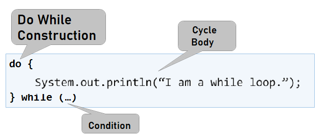

# Chapter 7.1. More Complex Loops

Having learned what **`for` loops** are and what they serve for, it is now time to get to know **other types of loops** and some **more complex loops constructs**. They will expand our knowledge and help us solve more challenging problems. In particular, we will have a look at how the following constructs are used:

  * loops **with a step**
  * **`while`** loops
  * **`do-while`** loops
  * **infinite** loops

In the current, chapter we will also get acquainted with the **`break`** statement and **how** to **terminate** a loop using it. We will also learn how to keep track of **errors** during the execution of our program, using a **`try-catch`** block. 

## Video

<div class="video-player">
  Watch a video lesson about While Loops: <a target="_blank"
  href="https://youtu.be/dG2Mcibyw3E">
  https://youtu.be/dG2Mcibyw3E</a>.
</div>

## Loops With a Step

In chapter **"Loops"**, we learned how the **`for`** loop works, and we already know when and for what purpose to use it. In this topic, we will pay **attention** to a specific and very important **part of its construction**, namely the **step**. 

### What is a Step?

The **step** is that **part** of the **`for`** loop construction that states **how** much to **increase** or **decrease** the value of its **leading** variable. It is declared last in the **`for`** loop block.

It most often has a **size `1`** and in that case instead of writing **`i += 1`** or **`i -= 1`**, we can use the **`i++`** or **`i--`** operators. If we want the step to be **different than 1**, we use the operator **`i += (step size)`** to increment and **`i -= (step size)`** to decrement. For a step size of 10, the loop would look like this:


The following is a series of examples, the solution of which will help us better understand the use of the **step** in the **`for`** loop.

### Problem: Numbers 1...N with Step 3

Write a program that prints the numbers **from 1 to n** with a **step 3**. For example, **if n = 100**, the result will be **1, 4, 7, 10, …, 94, 97, 100**. 

We can solve the problem through the following sequence of actions (algorithm):

  * We read the number **`n`** from the console input.
  * We run a **`for` loop** from **1** to **`n`** with a step size of **3**.
  * We print the value of the current step in **the body of the loop**.
  


#### Testing in The Judge System

Test your solution here: [https://judge.softuni.org/Contests/Practice/Index/659#0](https://judge.softuni.org/Contests/Practice/Index/659#0).


### Problem: Numbers N...1

Write a program that prints the numbers **from n to 1 in reverse order** (step -1). For example, **if n = 100**, the result will be **100, 99, 98, …, 3, 2, 1**.

We can solve the problem in the following way:

  * We read the number **`n`** from the console input.
  * We run a **`for` loop** in which we assign **`int i = n`**.
  * We reverse the loop condition: **`i >= 1`**.
  * We define the step size as **-1**.
  * We print the value of the current step in **the body of the loop**.


#### Testing in The Judge System

Test your solution here: [https://judge.softuni.org/Contests/Practice/Index/659#1](https://judge.softuni.org/Contests/Practice/Index/659#1).


### Problem: Powers of Two

In the following example, we will have a look at using the usual step with size 1 but with a slightly different logic in the body of the loop.

Write a program that prints the numbers ** from 1 to 2^n ** (two to the power of n). For example, **if n = 10**, the result will be **1, 2, 4, 8, 16, 32, 64, 128, 256, 512, 1024**.


#### Testing in The Judge System

Test your solution here: [https://judge.softuni.org/Contests/Practice/Index/659#2](https://judge.softuni.org/Contests/Practice/Index/659#2).


### Problem: Even Powers of 2

Print the **even** powers of **2** to **2^n**: **2^0, 2^2, 2^4, 2^8, …, 2^n**. For example, if **n = 10**, the result will be **1, 4, 16, 64, 256, 1024**.

Here is a way to solve the problem:

  * We create a variable **`num`** for the current number to which we assign an initial **value of 1**.
  * We set a value of **2** for the **step** of the loop.
  * In **the body of the loop**, we print the value of the current step and **increase the current number `num` 4 times** (as per the condition of the problem).


#### Testing in The Judge System

Test your solution here: [https://judge.softuni.org/Contests/Practice/Index/659#3](https://judge.softuni.org/Contests/Practice/Index/659#3).


## While Loop

The next type of loops we will get acquainted with are called **'while' loops**. What is specific about them is that they repeat a block of commands, **as long as a given condition is true**. Their structure differs from the **`for`** loops, and they even have a simplified syntax.


### What is a While Loop?

In programming, the **` while` loop** is used when we want to **repeat** the execution of a certain logic while **a given condition is met**. We define '**condition**' as any **expression** that returns **'true'** or **'false'**. When the **condition** is **false**, the **`while`** loop terminates and the program **continues** with the execution of the code following the loop. The **`while` loop** construction looks like this:


The following is a series of examples, the solution of which will help us better understand the use of the **`while`** loop.


### Problem: Sequence 2k+1

Write a program that prints all **numbers ≤ n** from the sequence: **1, 3, 7, 15, 31**, …, having in mind that each next number = **previous number \* 2 + 1**.

Here is how we can solve the problem:

* We create a variable **`num`** for the current number to which we assign an initial **value of 1**.
* We put the **current number <= n** as the loop condition.
* In **the body of the loop**, we print the value of the current number and increase the current number, using the formula from the problem.

Here is a sample representation of the described steps:


 
#### Testing in The Judge System

Test your solution here: [https://judge.softuni.org/Contests/Practice/Index/659#4](https://judge.softuni.org/Contests/Practice/Index/659#4).


### Problem: Numbers in Range [1…100]

Enter an integer in the range [**1 … 100**]. If it is invalid, input an integer again. In this case, we will consider any number that **is not** in the specified range as invalid.

We can solve the problem through the following algorithm:

* We create a variable **`num`**, to which we assign the integer value obtained from the console input.
* For a loop condition, we put an expression, that is **`true`** if the number of the input **is not** in the range specified in the problem condition.
* In **the body of the loop**: we print a message "**Invalid number!**" on the console, and then we assign a new value to **`num`** from the console input.
* Having validated the input number, we print its value outside the body of the loop.

Here is a sample representation of the algorithm, using a **`while` loop**:


#### Testing in The Judge System

Test your solution here: [https://judge.softuni.org/Contests/Practice/Index/659#5](https://judge.softuni.org/Contests/Practice/Index/659#5).


## Greatest Common Divisor (GCD)

Before proceeding to the next problem, it is necessary to get acquainted with the definition of the **greatest common divisor** (**GCD**).

**Definition of GCD**: the greatest common divisor of two **natural** numbers **a** and **b** is the largest number that divides **simultaneously** both **a** and **b** without a remainder. For example:


|a|b|GCD| 
|:---:|:---:|:---:| 
|24|16|8|
|67|18|1|
|12|24|12|
|15|9|3|
|10|10|10|
|100|88|4|

## The Euclidean Algorithm

In the next problem, we will use **the Euclidean algorithm**, one of the first published algorithms for finding the GCD:

**Until** we reach a remainder of 0:

* We divide the larger number by the smaller one.
* We take the remainder of the division.

**Pseudocode** for the Euclidean algorithm:

```java
while b ≠ 0
  var oldB = b;
  b = a % b;
  a = oldB;
print a;
```

### Problem: Greatest Common Divisor (GCD)

Enter **integers** **a** and **b** and find **GCD(a, b)**.

We will solve the problem using **the Euclidean algorithm**:

* We create **`a`** and **`b`** variables, to which we assign the **integer** values obtained from the console input.
* For a loop condition, we put an expression that is **`true`** if the **`b`** number **is different** than **0**.
* In **the body of the loop**: we follow the conditions of the pseudocode: 
   * We create a temporary variable, to which we assign the **current** value of **`b`**.
   * We assign a new value to **`b`**, which is the remainder of the division of **`a`** and **`b`**.
   * We assign the **previous** value of the **`b`** variable to **`a`**.
* Once the loop is complete and, we have found the GCD, we print it on the screen.


#### Testing in The Judge System

Test your solution here: [https://judge.softuni.org/Contests/Practice/Index/659#6](https://judge.softuni.org/Contests/Practice/Index/659#6).


## Do-While Loop

The next type of loop we will get acquainted with is the **`do-while`**. It resembles the **`while`** loop by structure, but there is a significant difference between the two. It consists in the fact that **`do-while`** will execute its body **at least once**. Why is this happening? At **`do-while`** loop construction, the **condition** is always checked **after** its body, which ensures that the code will be **executed** after the **first loop iteration**, and **the check for the loop termination** will be applied to each subsequent iteration of the **`do-while`**. 



The following is the usual series of sample problems, the solution of which will help us better understand the use of the **`do-while`** loop.


### Problem: Factorial

Calculate **n! = 1 \* 2 \* 3 \* … \* n**, where **n** is a natural number. For example, if **n = 5**, the result will be: **5!** = 1 \* 2 \* 3 \* 4 \* 5 = **120**.

Here is how we can calculate the factorial:

* We create the variable **`n`**, to which we assign the **integer** value obtained from the console input.
* We create another variable - **`fact`**, with the initial value of 1. We will use it to calculate and store the factorial.
* For a loop condition, we will use **`n > 1`**, since each time we perform the calculations in the body of the loop, we will reduce the value of **`n`** by 1.
* In **the body of the loop**: 
   * We assign a new value to the **`fact`**, which is the result of multiplying the current values of **`fact`** and **` n` **.
   * We decrease the value of **`n`** by **-1**.
* We print the final value of the factorial outside the body of the loop.


#### Testing in The Judge System

Test your solution here: [https://judge.softuni.org/Contests/Practice/Index/659#7](https://judge.softuni.org/Contests/Practice/Index/659#7).


### Problem: Sum Digits

Sum the digits of a **positive** integer **n**. For example, if **n = 5634**, the result will be: 5 + 6 + 3 + 4 = **18**.

We can use the following idea to solve the problem:

* We create the variable **`n`** to which we assign a value equal to the number entered by the user.
* We create a second variable - **`sum`**, with the initial value of 0. We will use it to calculate and store the result.
* For a loop condition, we will use **`n > 0`**, since we will remove the last digit of ** `n` ** after each calculation of the result in the body of the loop.
* In the body of the loop:
   * We assign a new value to **`sum`**, equals to the sum of the current value of **`sum`** and the last digit of **`n`**.
   * We assign a new value to **`n`**, which is the result of removing the last digit of **`n`**.
* We print the final value of the sum outside the body of the loop.


<table><tr><td></td>
<td><code><strong>n % 10</strong></code>: <b>returns</b> the last digit of the number <code><strong>n</strong></code>.<br>
<code><strong>n / 10</strong></code>: <b>deletes</b> the last digit of <strong><code>n</code></strong>.</td>
</tr></table>

#### Testing in The Judge System

Test your solution here: [https://judge.softuni.org/Contests/Practice/Index/659#8](https://judge.softuni.org/Contests/Practice/Index/659#8).


## Infinite Loops and `break` Operator

So far, we got acquainted with different types of loops and learned about their constructions and how they are applied. Now, we need to understand what an **infinite loop** is, when it occurs and how we can **terminate** its execution through the **`break`** operator.

### What is an Infinite Loop?

An infinite loop **repeats infinitely** the execution of its body. For **`while`** and **`do-while`** loops the check for the end of a loop is a conditional expression that **always** returns **`true`**. An infinite **`for`** occurs when there is **no condition to end the loop**. 

Here is what an **infinite `while`** loop looks like:


And here is what an **infinite `for`** loop looks like:


### The `break` Operator

We already know that the infinite loop executes a specific code to infinity, but what if we want to forcibly exit the loop under a given condition at some point? In this situation, the **`break`** operator comes in handy.

<table><tr><td></td>
<td>The <b><code>break</code></b> operator stops the loop execution at the moment it is called and continues from the first line after the end of the loop. This means that the current iteration of the loop will not be completed and, accordingly the rest of the code in the body of the loop will not be executed. </td>
</tr></table>

### Problem: Prime Number Checking

The next problem we are going to solve requires conducting a **prime number check**. Before proceeding with it, let’s remember what prime numbers are.

**Definition**: an integer is **prime** when it is divisible without remainder only to itself and 1. By definition, prime numbers are positive and greater than 1. The smallest prime number is **2**.

We can assume that an integer **n** is prime if **n > 1** and **n** is not divisible by any of the numbers between **2** and **n-1**.

The first few prime numbers are: 2, 3, 5, 7, 11, 13, 17, 19, 23, 29, 31, 37, 41, 43, …

In contrast, **non-prime (composite) numbers** are such numbers that are composed of the product of prime numbers.

Here are a few examples of composite numbers:
* **10** = 2 * 5
* **42** = 2 * 3 * 7
* **143** = 13 * 11

**Verification algorithm** whether an integer is **prime**: we check if **n > 1** and **n** are divisible by **2**, **3**, …, **n-1** without remainder.
* If it is divisible by any of the numbers, it is **composite**.
* If it is not divisible by any of the numbers, then it is **prime**.

<table><tr><td></td>
<td>We can optimize the algorithm by checking the divisors to <code><strong>√n</strong></code> instead of <code><strong>n-1</strong></code>. Think about the reason why.</td>
</tr></table>

### Problem: Check Prime

Check if a number **n** is prime. To do so, we will check if **n** is divisible by the numbers between 2 and √n. 

Here is the algorithm for prime number verification, described in steps:

* We create the variable **`n`**, to which we assign the **integer** value obtained from the console input.
* We create a boolean variable - **`isPrime`** with an initial value **`true`** **if the number is equal or greater than two** (since by definition, numbers such as 0, 1, -1, and -2 are non-prime). We assume that a number is prime until proven otherwise.
* We create a **`for`** loop, and we assign 2 as an initial value of the loop variable and **its current value `<= √n`** as a condition. The step of the loop is 1.
* In **the body of the loop**, we check if **`n`** divided by **the current value** has a remainder. If there is no remainder, we change the value of **`isPrime`** to **`false`** and forcibly terminate the loop with a **`break`** operator.
* Depending on the **`isPrime`** value, we print whether the number is prime (**`true`**) or composite (**`false`**).

Here is a sample implementation of the described algorithm:


#### Testing in The Judge System

Test your solution here: [https://judge.softuni.org/Contests/Practice/Index/659#9](https://judge.softuni.org/Contests/Practice/Index/659#9).


### Problem: Enter Even Number

Write a program that checks if a number **n** is even – if it is, prints it on the screen. An even number is each number that is divisible by 2 without a remainder. In the case of an invalid number, it should be re-input, and a message stating that the number is not even should be displayed. 

Here is an idea of how to solve the problem:

* We create a variable **`n`**, to which we assign an initial value of **0**.
* We create an infinite **`while`** loop and put **`true`** as a condition.
* In **the body of the loop**:
   * We take the integer obtained by the console input and assign it to **`n`**.
   * If **the number is even**, we exit the loop with a **`break`**. 
   * **Otherwise**, we display a message stating that **the number is not even**. The iterations continue until an even number is entered.
* We print the even number on the screen.

Here is a sample implementation of the idea:


Note: although the code above is correct, it will not work if the user enters text instead of numbers, for example, **Invalid number**. Then the parsing of the input text to a number will break, and the program will display an **error message (exception)**. Later in this chapter, we will learn how to deal with this problem and how to catch and handle exceptions using the **`try-catch` construct**.

#### Testing in The Judge System

Test your solution here: [https://judge.softuni.org/Contests/Practice/Index/659#10](https://judge.softuni.org/Contests/Practice/Index/659#10).


## Nested Loops and The `break` Operator

Having learned what **nested loops** are and how the **`break`** operator performs, it is time to understand how they both work together. For a better understanding, let’s write a step-by-step **program** that should make all possible combinations of **pairs of numbers**. The first number of the combination is increasing from 1 to 3, and the second one is decreasing from 3 to 1. The problem must continue running until **`i + j`** **is not equal** to 2 (i.e., **`i = 1`** and **`j = 1`**).

The desired result is:


Here is one **wrong solution**, which seems correct at first glance:


If we leave our program this way, the result will be the following:


Why does this happen? As we can see, the result **is missing `1 1`**. When the program reaches the point that **`i 1`** and **`j 1`**, it enters the **`if`** check and performs the **`break`** operation. Thus, we **exit the inner loop**, but then the execution of the outer loop continues. **`i`** increases, the program enters the inner loop and prints the result.

<table><tr><td></td>
<td>When we use the <b><code>break</code></b> operator in a <b>nested loop</b>, it interrupts the execution of the inner loop <b>only</b>.</td>
</tr></table>

What is **the correct solution**? One way of solving this problem is by declaring a **`bool` variable**, which keeps track of whether the loop should continue. In case of need to exit (from all nested loops), the variable is set to **'true'** and exits the internal cycle with a **'break'**, and at the next check, will exit from the outer loop. Here is a sample implementation of this idea:


Thus, when **`i + j = 2`**, the program will set the **`hasToEnd = true`** and exit the inner loop. Upon the next iteration of the outer loop due to the **`if`** check, the program will not reach the inner loop and interrupt its execution. 

### Testing in The Judge System

Test your solution here: [https://judge.softuni.org/Contests/Practice/Index/659#11](https://judge.softuni.org/Contests/Practice/Index/659#11).


## Error Handling: `try-catch` Construction

The last thing we will get familiar with within this chapter is how to "catch" **errors** with the **`try-catch`** construction.

### What is a `try-catch`?

The **`try-catch`** program construction is used to **intercept and handle exceptions (errors)** during the program execution.

In programming, **exceptions** are notifications of an event that disrupts the normal operation of a program. Such exceptional events **interrupt the execution** of our program, and it is looking for something to handle the situation. If it does not find it, the exception is printed on the console (the program "fails"). If it finds, **the exception is processed** and the program continues its normal execution without "failing". In a bit, we will see how this happens.

When an exception occurs, the exception is said to have been **”thrown” (throw exception)**. Hence the expression **”catch exception”**.

### The `try-catch` Construction

The **`try-catch`** construction has different types, but for now, we will get acquainted only with the most basic of them, where the **`catch`** block will intercept any error in a variable named **`ex`**

 
 
In the next problem, we will see how to handle a situation where the user enters an input other than a number (for example, **`string`** instead of **`int`**) using ** `try-catch` **.

### Problem: Enter Even Number (with Text Input)

Write a program that checks if a number **n** is even – if it is, prints it on the screen. Upon entering an **invalid number**, a message appears stating that the input data is not a valid number, and another input data must be made.

Here is how we can solve the problem:

* We create an infinite **`while`** loop, for which we set **`true`** as a condition.
* In the body of the loop:
	* We create a **`try-catch`** construction.
	* In the **`try`** block, we write the programming logic for reading the user input, parsing it to a number, and then checking for an even number.
	* If **the number is even**, we print it and exit the loop (with **`break`**). The program is done, and it ends.
	* If **the number is odd**, we print a message that an even number is required, without exiting the loop (since we want to repeat the step by entering input data).
	* If we **catch an exception** upon executing the **`try`** block, we write a message for an invalid input number, and the loop is repeated because we do not explicitly exit it.

Here is a sample implementation of the described idea:


#### Testing in The Judge System

Test your solution here: [https://judge.softuni.org/Contests/Practice/Index/659#12](https://judge.softuni.org/Contests/Practice/Index/659#12).

Now the solution should always work whether we enter integers, invalid numbers (for example, too many digits), or texts that do not contain numbers.


### Problems with Loops

In this chapter, we have introduced several new types of loops that we can use to make repetitions with more complex program logic. Let's solve several problems using the new knowledge.

### Problem: Fibonacci

In mathematics, Fibonacci numbers form a series that looks like this: **1, 1, 2, 3, 5, 8, 13, 21, 34, …**

**The formula** to form the sequence is:

```java
F0 = 1
F1 = 1
Fn = Fn-1 + Fn-2
```

#### Sample Input and Output

|Input (n)|Output|Comment|
|----|-----|---------|
|10|89|F(11) = F(9) + F(8)|
|5|8|F(5) = F(4) + F(3)|
|20|10946|F(20) = F(19) + F(18)|
|0|1| |
|1|1| |

Write a program in which we enter an **integer** number **n** and calculate the **n-number of Fibonacci**.

#### Hints and Guidelines

An idea to solve the problem:

* We create a **`n` variable**, to which we assign the **integer** value obtained from the console input.
* We create **`f0`** and **`f1`** variables to which we assign value **1** since this is how the sequence begins.
* We create a **`for`** loop with a condition **current value `i < n - 1`**.
* In the **body of the loop:**
   * We create a **temporary** variable **`fNext`** to which we assign the next number of the Fibonacci sequence.
   * We assign the current value of **`f1`** to **`f0`**.
   * We assign the value of the temporary variable **`fNext`** to **`f1`**.
* We print the n-number of Fibonacci outside the loop.

Sample implementation:


#### Testing in The Judge System

Test your solution here: [https://judge.softuni.org/Contests/Practice/Index/659#13](https://judge.softuni.org/Contests/Practice/Index/659#13).


### Problem: Number Pyramid

Print **the numbers 1… n in a pyramid** as in the examples below. On the first line, we print one number on the second line, we print two numbers, on the third line, we print three numbers, etc., until the numbers run out. On the last line, we print as many numbers as we have left until we get to **n**.

#### Sample Input and Output

|Input |Output                 |Input |Output          |Input      |Output                         |
|-----|----------------------|-----|---------------|----------|------------------------------|
|7    |1<br>2 3<br>4 5 6<br>7|5    |1<br>2 3<br>4 5|10        |1<br>2 3<br>4 5 6<br>7 8 9 10 |

#### Hints and Guidelines

We can solve the problem with **two nested loops** (by rows and columns) by printing in them and leaving when reaching the last number. Here is the idea, described in more detail:

* We create a **`n`** variable, to which we assign the integer value obtained from the console input.
* We create a **`num`** variable with an initial value of 1. It will keep the number of printed numbers. At each iteration, we will **increase** it by **1** and print it.
* We create an **outer** **`for`** loop, which will be responsible for the **rows** in the table. We name the loop variable as a **`row`** and assign it an initial value of 0. We set **`row < n`** as a condition. The size of the step is 1.
* In the body of the loop, we create an **inner** **`for`** loop, which will be responsible for the **columns** in the table. We name the loop variable as **`col`** and assign it an initial value of 0. We set **`col < row`** (**`row`** = number of digits per line) as a condition. The size of the step is 1.
* In the body of the loop:
   * We check if **`col > 1`** and if yes – we print space. If we don't perform this check and directly print space, we will have an unnecessary one at the beginning of each line.
   * We **print** the number **`num`** in the current cell of the table and **increase it by 1**.
   * We perform a check for **`num > n`**. If **`num`** is greater than **`n`**, we **break** the **inner loop**.
* We print a **blank line** to proceed to the next one.
* We check again if **`num > n`**. If it's greater, we **interrupt** the execution of our **program** with a **`break`**.

Here is a sample implementation:


#### Testing in The Judge System

Test your solution here: [https://judge.softuni.org/Contests/Practice/Index/659#14](https://judge.softuni.org/Contests/Practice/Index/659#14).


### Problem: Number Table

Print the numbers 1 … n in a table as per the examples below.

#### Sample Input and Output

|Input |Output|Input|Output|
|--------|-----|-------|-----|
|3|1 2 3<br>2 3 2<br>3 2 1|4|1 2 3 4<br>2 3 4 3<br>3 4 3 2<br>4 3 2 1|

#### Hints and Guidelines

We can solve the problem with **two nested loops** and a few calculations inside:

* We read from the console the table size in an integer variable **`n`**.
* We create a **`for`** loop, which is responsible for the table rows. We name the loop variable as a **`row`** and assign it an initial **value 0**. We set **`row < n`** as a condition. The size of the step is 1.
* In **the body of the loop**, we create a nested **`for`** loop, which is responsible for the table columns. We name the loop variable as **`col`** and assign it an initial **value of 0**. We set **`col < n`** as a condition. The size of the step is 1.
* In **the body of the nested loop**:
   * We create a **`num`** variable, to which we assign the result of **current row + current column + 1** (+1, since we start counting from 0).
   * We perform a check if **`num > n`**. If **`num`** is **greater** than n, we assign a new value of **two times n - current value of `num`** to **`num`**. We do this to not exceed **`n`** in any of the table cells.
    * We print the number from the current table cell.
* We print a **blank line** in the outer loop to proceed to the next one.


#### Testing in The Judge System

Test your solution here: [https://judge.softuni.org/Contests/Practice/Index/659#15](https://judge.softuni.org/Contests/Practice/Index/659#15).


## What Have We Learned from This Chapter?

We can use the **`for`** loops with a **step**:

```java
for (int i = 1; i <= n; i+=3) {
   System.out.println(i);
}
```

The **`while`** / **`do-while`** loops are repeated as long as a given **condition** is true:

```java
int num = 1;
while (num <= n) {
   System.out.println(num++);
}
```

If we need to **interrupt** the loop execution, we use the **`break`** operator:

```java
int n = 0;
while (true) {
   n = Integer.parseInt(scanner.nextLine());
   if (n % 2 == 0)  {
      break; // even number -> exit from the loop
   }
   System.out.println("The number is not even.");
}
System.out.println("Even number entered: {0}", n);
```

We already know how to catch **errors** during the execution of our program:

```java
try {
    System.out.println("Enter even number: ");
    int n = Integer.parseInt(scanner.nextLine());
} catch (Exception ex) {
    System.out.println("Invalid number.");
}
// If Integer.parseInt(…) fails, the catch { … } block will be executed
```
