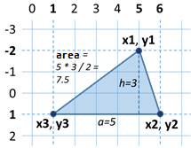

# Chapter 8.1. Practical Exam Preparation – Part I

In **the current chapter**, we will examine a few **problems** with a level of **difficulty** that can be expected in **the problems** of the practical **exam** at SoftUni.

## Practical Exam

The **practical exam** includes **6** problems, for which you will have **4 hours**, to solve. **Each** of the exam problems will **cover** one of the **topics** studied in this book. The themes of the problems are as follows:

- problem with simple calculations \(no conditions\)
- problem with simple condition
- problem with more complex conditions
- problem with a simple loop
- problem with nested loops (drawing a figure on the console)
- problem with nested loops and more complex logic

## The Online Evaluation System (Judge)

**All exams and exercises** from this book are automatically **tested** through the online **Judge system**: [https://judge.softuni.org](https://judge.softuni.org). For **each** of the problems, there are **visible** \(zero point\) tests to help you understand what is expected of the problem and fix your mistakes, as well as **competition** tests that are **hidden** and check if your solution is working properly.

**How** does the testing in **Judge** work? **You upload** the source code and from the menu below you choose to compile it as a **Java** program. The program is being **tested** with a series of tests, giving **points** for each **successful** test.

## Simple Calculations – Problems

**The first** problem of the Practical Exam covers **simple calculations without checks and loops**. Here are a few problems:

### Problem: Triangle Area

<table>
   <tr>
      <td width="60%">
        <b>A triangle in the plane</b> is defined by the coordinates of its three vertices. First, the vertex <b>(x1, y1)</b> is set. Then the other two vertices are set: <b>(x2, y2)</b> and <b>(x3, y3)</b>, which <b>lie on a common horizontal line</b> (i.e. they have the same Y coordinates). Write a program that calculates <b>the area of the triangle</b> by the coordinates of its three vertices.
      </td>
      <td>
         
      </td>
   </tr>
</table>

#### Input Data
The console provides **6 integers** (one per line):
**x1, y1, x2, y2, x3, y3.**
-	All input numbers are in the range [**-1000 … 1000**].
-	It is guaranteed that **y2 = y3**.

#### Output Data
Print on the console **the area of the triangle**.

#### Sample Input and Output

|Input|Output|Visualization|Comments|
|----|----|----|----|
|5 -2 6 1 1 1|7.5||The side of the triangle **a** = 6 - 1 = **5** The height of the triangle **h** = 1 - (-2) = **3** The area of the triangle **S** = a \* h / 2 = 5 \* 3 / 2 = **7.5**|

|Input|Output|Visualization|Comments|
|----|----|----|----|
|4 1 -1 -3 3 -3|8||The side of the triangle **a** = 3 - (-1) = **4** The height of the triangle **h** = 1 - (-3) = **4** The area of the triangle **S** = a \* h / 2 = 4 \* 4 / 2 = **8**|

#### Hints and Guidelines

It is very important when facing such types of problems where some coordinates are given to pay attention to **the order** in which they are submitted and to properly understand which of the coordinates we will use and how. In this case, the input is in order **x1, y1, x2, y2, x3, y3**. If we do not follow this sequence, the solution becomes incorrect. First, we write the code that reads the input data:

We have to calculate **the side** and **the height** of the triangle. From the pictures, as well as the condition **`y2 = y3`**, we notice that the one **side** is always parallel to the horizontal axis. This means that its **length** is equal to the length of the segment between its coordinates **`x2` and `x3`**, which is equal to the difference between the larger and the smaller coordinates. Analogically, we can calculate **the height**. It will always be equal to the difference between **`y1` and `y2`** (or **`y3`**, as they are equal). Since we do not know if **`x2`** is greater than **`x3`**, or **`y1`** will be below or above the triangle side, we will use **the absolute values** of the difference to always get positive numbers because one segment cannot have a negative length.

we will calculate it using our familiar formula for finding an **area of a triangle**. An important thing to consider is that although we get only integers at an input, **the area** will not always be an integer. That's why we use a variable of **`double`** type for the area. We have to convert the right side of the equation because if we give whole numbers as equation parameters, our result will also be an integer.

The only thing left is to print the area on the console.

#### Testing in The Judge System

Test your solution here: [https://judge.softuni.org/Contests/Practice/Index/661#0](https://judge.softuni.org/Contests/Practice/Index/661#0).

### Problem: Bricks

Construction workers have to transfer a total of **x bricks**. **Workers** are **w** in numbers and work simultaneously. They transport the bricks in trolleys, each with a **capacity of m** bricks. Write a program that reads the integers **x**, **w**, and **m**, and calculates **what is the minimum number of courses** the workers need to do to transport the bricks.

#### Input Data

On the console **3 integers** are given, one per line:
- **The number of bricks x** is read from the first line.
- **The number of workers w** is read from the second line.
- **The capacity of the trolley m** is read from the third line.

All input numbers are integers in the range [**1 … 1000**].

#### Output Data

Print on the console **the minimum number of courses** needed to transport the bricks.

#### Sample Input and Output

|Input|Output|Comments|
|----|----|----|
|120 2 30|2|We have **2** workers, each transporting **30** bricks per course. In total, workers are transporting **60** bricks per course. To transport **120** bricks, exactly **2** courses are needed.|

|Input|Output|Comments|
|----|----|----|
|355 3 10|12|We have **3** workers, each transporting **10** bricks per course. In total, workers are transporting **30** bricks per course. To transport **355** bricks, exactly **12** courses are needed: **11** complete courses carry **330** bricks and the last twelfth course carries the last **25** bricks.|

|Input|Output|Comments|
|----|----|----|
|5 12 30|1|We have **5** workers, each transporting **30** bricks per course. In total, workers are transporting **150** bricks per course. To transport **5** bricks, only **1** course is sufficient (although incomplete, with only 5 bricks).|

#### Hints and Guidelines

The input is standard, and we only need to be careful about the sequence in which we read the data.

We calculate how many **bricks** the workers transport in a single course.

By dividing the total number of **bricks transported for 1 course**, we will obtain the number of **courses** required to carry them. We have to consider that when dividing whole numbers, the remainder is ignored and always rounded down. To avoid this, we will convert the right side of the equation to **`double`** and use the **`Math.ceiling(…)`** function to round the result always up. When the bricks can be transferred with **an exact number of courses**, the division will return a whole number and there will be nothing to round. Accordingly, if not, the result of the division will be **the number of exact courses** but a decimal fraction. The decimal part will be rounded up and we will get the required **1 course** for the remaining bricks.

Finally, we print the result on the console.

#### Testing in The Judge System

Test your solution here: [https://judge.softuni.org/Contests/Practice/Index/661#1](https://judge.softuni.org/Contests/Practice/Index/661#1).

## Simple Conditions – Problems

**The second** problem of the Practical Exam covers **conditional statements and simple calculations**. Here are a few problems:

### Problem: Point on a Segment

**A horizontal segment** is placed on a horizontal line, set with the **x** coordinates of both ends: **first** and **second**. **A point** is located **on** the same horizontal line and is set with its **x coordinate**. Write a program that checks whether the point is **inside or outside the segment** and calculates **the distance to the nearest end** of the segment.

#### Input Data

The console reads **3 integer numbers** (one per line):
- On the first line, the number "first" is read – **one end of the segment**.
- On the second line, the number "second" is read – **the other end of the segment**.
- On the third line, the number "point" is read – **the location of the point**.

All input numbers are integers in the range [**-1000 … 1000**].

#### Output Data

Print the result on the console:
- On the first line, print "**in**" or "**out**" – whether the point is inside or outside the segment.
- On the second line, print the distance from the point to the nearest end of the segment.

#### Sample Input and Output

|Input|Output|Visualization|
|---|---|---|
|10 5 7|in 2||

|Input|Output|Visualization|
|---|---|---|
|8 10 5|out 3||

|Input|Output|Visualization|
|---|---|---|
|1 -2 3|out 2||

#### Hints and Guidelines

We read the input from the console.

Since we do not know which **point** is on the left and which is on the right, we will create two variables to mark this. Since the **left point** is always the one with the smaller **x coordinate**, we will use **`Math.min(…)`** to find it.  Accordingly, **the right one** is always the one with a larger **x coordinate** and we will use **`Math.max(…)`**. We will also find the distance from **point x** to **the two points**. Because we do not know their position relative to each other, we will use **`Math.abs(…)`** to get a positive result.

The shorter of the two **distances** we can find using **`Math.min(…)`**.

What remains is to find whether **the point** is on or out of the line. The point will be **on the line** whenever it **matches** one of the other two points or its x coordinate lies **between them**. Otherwise, the point is **outside the line**. After checking, we display one of the two messages, depending on which condition is satisfied.

Finally, we print **the distance** previously found.

#### Testing in The Judge System

Test your solution here: [https://judge.softuni.org/Contests/Practice/Index/661#2](https://judge.softuni.org/Contests/Practice/Index/661#2).

### Problem: Point in a Figure

Write a program that checks whether a point (with coordinates **x** and **y**) is **inside** or **outside** the following figure:
 

#### Input Data

The console reads **two integers** (one per line): **x** and **y**.

All input numbers are integers in the range **[-1000 … 1000]**.

#### Output Data

Print on the console "**in**" or "**out**" – whether the point is **inside** or **outside** the figure (the outline counts as inside).

#### Sample Input and Output

|Input|Output|Input|Output|
|----|----|----|----|
|8 -5|in|6 -3|in|

|Input|Output|Input|Output|
|----|----|----|----|
|11 -5|out|11 2|out|

#### Hints and Guidelines

To find whether our **point** is in the figure, we will divide **the figure** into 2 rectangles:

A sufficient condition is **a point** to be located in one of them, to be in **the figure**.

We read the input data from the console:

We will initialize two variables that will mark whether **the point** is in one of the rectangles. When printing the message, we will check whether any of the variables has accepted a value of **`true`**. It is enough for **only one** of them to be **`true`** so that the point is in the figure.

#### Testing in The Judge System

Test your solution here: [https://judge.softuni.org/Contests/Practice/Index/661#3](https://judge.softuni.org/Contests/Practice/Index/661#3).

## Complex Conditions – Problems

**The third** problem of the Practical Exam includes **several nested checks combined with simple calculations**. Here are a few problems:

### Problem: Date After 5 days

There are two numbers given - **d** (day) and **m** (month) that form **a date**. Write a program that prints the date that will be **5 days a particular date**. For example, 5 days after **28.03** is the date **2.04**. e assume that the months: April, June, September, and November have 30 days, February has 28 days, and the rest have 31 days. Months to be printed with **leading zero** when they contain a single digit (e.g. 01, 08).

#### Input Data

The input is read from the console and consists of two lines:
-	On the first line, we read an integer **d** in the range [**1 … 31**] – day. The number of days does not exceed the number of days in that month (e.g. 28 for February).
-	On the second line, we read an integer **m** in the range [**1 … 12**] – month. Month 1 is January, month 2 is February,  …, month 12 is December. The month may contain a leading zero (e.g. April may be written as 4 or 04).

#### Output Data

Print a single line containing the date after 5 days in the format **day.month** on the console. The month must be a 2-digit number with a leading zero, if necessary. The day must be written without leading zero.

#### Sample Input and Output

|Input|Output|Input|Output|
|---|---|---|---|
|28 03|2.04|27 12|1.01|

|Input|Output|Input|Output|
|---|---|---|---|
|25 1|30.01|26 02|3.03|

#### Hints and Guidelines

We take the input from the console.

To make our checks easier, we'll create a variable that will contain the **number of days** that we have in the month we set.

We increase **the day** by 5.

We check if **the day** has not exceeded the number of days in the **month**. If so, we must deduct the days of the month from the obtained day to calculate which day of the next month our day corresponds to.

After we have passed to the **next month**, this should be noted by increasing the initial one by 1. We need to check if it has not become greater than 12 and if it has, to adjust it. Because we cannot skip more than **one month** when we increase by 5 days, the following check is enough.

The only thing that remains is to print the result on the console. It is important to **format the output** correctly to display the leading zero in the first 9 months. This is done by adding a **formatting string**** **`%02d`** at the second element. **`0`** shows what number must be used in that place, and **`2`** shows the number of digits that must be filled with the corresponding number.

#### Testing in The Judge System

Test your solution here: [https://judge.softuni.org/Contests/Practice/Index/661#4](https://judge.softuni.org/Contests/Practice/Index/661#4).

### Problem: Sums 3 Numbers

There are **3 integers** given.  Write a program that checks if **the sum of two of the numbers is equal to the third one**. For example, if the numbers are **3**, **5**, and **2**, the sum of two of the numbers is equal to the third one: **2 + 3 = 5**.

#### Input Data

The console reads **three integers**, one per line. The numbers are in the range [**1 … 1000**].

#### Output Data

-	Print a text line on the console containing the solution of the problem in the format "**a + b = c**", where **a**, **b** and **c** are among the three input numbers and **a ≤ b**.
-	If the problem has no solution, print "**No**" on the console.

#### Sample Input and Output

|Input|Output|Input|Output|
|---|---|---|---|
|3 5 2|2 + 3 = 5|2 2 4|2 + 2 = 4|

|Input|Output|Input|Output|
|---|---|---|---|
|1 1 5|No|2 6 3|No|

#### Hints and Guidelines

We take the input from the console.

We have to check if the **sum** of a pair of numbers is equal to the third number. We have three possible cases:
* a + b = c
* a + c = b 
* b + c = a

We will write a **template**, which will later be complemented by the required code. If none of the above three conditions is met, we will make our program print "**No**".

We now have to understand the order in which the **two addends** will be written in the output of the program. For this purpose, we will create **a nested condition** that checks which one of the two numbers is the larger one. In the first case, it will look like this:

Similarly, we will supplement the other two cases. The full code of the program will look like this:

#### Testing in The Judge System

Test your solution here: [https://judge.softuni.org/Contests/Practice/Index/661#5](https://judge.softuni.org/Contests/Practice/Index/661#5).

## Simple Loops – Problems

**The fourth** problem of the Practical Exam includes a **single loop with simple logic** in it. Here are a few examples:

### Problem: Sums Step 3

We are given **n** integers: **a1, a2, …, an**. Calculate the sums:
-	**sum1 = a1 + a4 + a7** + … (the numbers are summed, starting from the first one with step of 3).
- **sum2 = a2 + a5 + a8** + … (the numbers are summed, starting from the second one with step of 3).
-	**sum3 = a3 + a6 + a9** + … (the numbers are summed, starting from the third one with step of 3).

#### Input Data

The input data is read from the console. The first line holds an integer **n (0 ≤ n ≤ 1000)**. On the next **n** lines, we are given **n** integers in the range [**-1000 … 1000**]: **a1, a2, …, an**.

#### Output Data

On the console, we should print 3 lines containing the 3 sums in a format such as in the example.

#### Sample Input and Output

|Input|Output|Input|Output|Input|Output|
|---|---|---|---|---|---|
|2 3 5 |sum1 = 3 sum2 = 5 sum3 = 0|4 7 -2 6 12|sum1 = 19 sum2 = -2 sum3 = 6|5 3 5 2 7 8|sum1 = 10 sum2 = 13 sum3 = 2| 

#### Hints and Guidelines

We will take **the count of numbers** from the console and declare **starting values** of the three sums.

Since we do not know in advance how many numbers we will process, we will take them one at a time in **a loop** which will be repeated **n times** and we will process them in the body of the loop.

To find out in which of **the three sums** we need to add the number, we will divide its **sequence number into three** and we will use the remainder. We will use the variable **`i`**, which tracks **the number of runs** of the loop, to find out which sequence number we are at. When the remainder of **`i/3`** is **zero**, it means we will add this number to **the first** sum, when it is **1** to the **second** one, and when it is **2** to **the third** one.

Finally, we will print the result on the console in the required **format**.

#### Testing in The Judge System

Test your solution here: [https://judge.softuni.org/Contests/Practice/Index/661#6](https://judge.softuni.org/Contests/Practice/Index/661#6).

### Problem: Increasing Elements

A series of **n** numbers is given: **a1**, **a2**, **…**, **an**. Calculate **the length of the longest increasing sequence** of consecutive elements in the series of numbers.

#### Input Data

The input data is read from the console. The first line holds an integer **n** (**0 ≤ n ≤ 1000**). On the following **n** lines, we are given **n** integers in the range [**-1000 … 1000**]: **a1**, **a2**, **…**, **an**.

#### Output Data

On the console, we must print one number – **the length** of the longest increasing sequence.

#### Sample Input and Output

|Input|Output|Input|Output|Input|Output|Input|Output|
|---|---|---|---|---|---|---|---|
|3 5 2 4|2|4 2 8 7 6|2|4 1 2 4 4|3|4 5 6 7 8|4|

#### Hints and Guidelines

To solve this problem, we need to think in a bit **more algorithmic way**.  A **sequence of numbers** is given to us, and we need to check whether each **subsequent** one will be **larger than the previous one** and if so, we count how long is the sequence in which this condition is fulfilled. Then we have to find **which sequence** of these is **the longest** one. To do this, let's create some variables that we will use during solving the problem.

The variable **`n`** is **the count of numbers** we get from the console. In **`countCurrentLongest`** we will keep **the number of elements** in the increasing sequence we are **currently counting**. For example, in the sequence: 5, 6, 1, 2, 3 **`countCurrentLongest`** will be 2 when we reach **the second element** of the counting (5, **6**, 1, 2, 3) and will become 3 when we reach the **last element** (5, 6, 1, 2, **3**), because the increasing row 1, 2, 3 has 3 elements. We will use **`countLongest`** to keep the **longest** increasing sequence. The other variables are **`a`** – the number we are **currently in**, and **`aPrev`** – **the previous number** which we will compare with **`a`** to see if the row is **growing**.

We begin to run the numbers and check if the present number **`a`** is larger than the previous **`aPrev`** one. If this is true, then the row **is growing**, and we need to increase its number by **1**. This is stored in the variable that tracks the length of the sequence we are currently in – **`countCurrentLongest`**. If the number **`a`** is **not greater** than the previous one, it means that **a new sequence** starts, and we have to start the count from **1**. Finally, after all the checks are done, **`aPrev`** becomes **the number** we are **currently** using, and we start the loop from the beginning with **the next** entered **`a`**.

Here is a sample implementation of the algorithm described:

What remains is to see which of all sequences is **the longest** one. We will do this by checking in the loop if **the sequence** we are **currently** in has become longer than the **longest one by now**. The whole loop will look like this:

Finally, we print the length of **the longest** sequence found.

#### Testing in The Judge System

Test your solution here: [https://judge.softuni.org/Contests/Practice/Index/661#7](https://judge.softuni.org/Contests/Practice/Index/661#7).

## Drawing Figures on The Console – Problems

**The fifth** problem of the Practical Exam requires **using one or several nested loops** for drawing a figure on the console. Logical deductions, simple calculations, and checks might be required. The problem checks the students' abilities to think logically and come up with simple algorithms for solving problems, i.e. to think algorithmically. Here are a few examples for an exam problem:

### Problem: Perfect Diamond

Write a program that reads an integer **n** from the console and draws **a perfect diamond** with size **n** as in the examples below.

#### Input Data

The input is an integer **n** within the range [**1 … 1000**].

#### Output Data

The diamond should be printed on the console as in the examples below.

#### Sample Input and Output

|Input|Output|Input|Output|
|----|----|----|----|
|2|<code>&nbsp;&#42;&nbsp;</code> <code>&#42;-&#42;</code> <code>&nbsp;&#42;&nbsp;</code>|3|<code>&nbsp;&nbsp;&#42;&nbsp;&nbsp;</code> <code>&nbsp;&#42;-&#42;&nbsp;</code> <code>&#42;-&#42;-&#42;</code> <code>&nbsp;&#42;-&#42;&nbsp;</code> <code>&nbsp;&nbsp;&#42;&nbsp;&nbsp;</code> |

|Input|Output|Input|Output|
|---|---|---|---|
|4|<code>&nbsp;&nbsp;&nbsp;&#42;&nbsp;&nbsp;&nbsp;</code> <code>&nbsp;&nbsp;&#42;-&#42;&nbsp;&nbsp;</code> <code>&nbsp;&#42;-&#42;-&#42;&nbsp;</code> <code>&#42;-&#42;-&#42;-&#42;</code> <code>&nbsp;&#42;-&#42;-&#42;&nbsp;</code> <code>&nbsp;&nbsp;&#42;-&#42;&nbsp;&nbsp;</code> <code>&nbsp;&nbsp;&nbsp;&#42;&nbsp;&nbsp;&nbsp;</code> |5|<code>&nbsp;&nbsp;&nbsp;&nbsp;&#42;&nbsp;&nbsp;&nbsp;&nbsp;</code> <code>&nbsp;&nbsp;&nbsp;&#42;-&#42;&nbsp;&nbsp;&nbsp;</code> <code>&nbsp;&nbsp;&#42;-&#42;-&#42;&nbsp;&nbsp;</code> <code>&nbsp;&#42;-&#42;-&#42;-&#42;&nbsp;</code> <code>&#42;-&#42;-&#42;-&#42;-&#42;</code> <code>&nbsp;&#42;-&#42;-&#42;-&#42;&nbsp;</code> <code>&nbsp;&nbsp;&#42;-&#42;-&#42;&nbsp;&nbsp;</code> <code>&nbsp;&nbsp;&nbsp;&#42;-&#42;&nbsp;&nbsp;&nbsp;</code> <code>&nbsp;&nbsp;&nbsp;&nbsp;&#42;&nbsp;&nbsp;&nbsp;&nbsp;</code> |

#### Hints and Guidelines

From the given input results we can see that we are required to print repeating symbols. That's why in advance we type a method that we will use to repeat the same symbol that times as we need it.

In problems for drawing figures, the most important thing to consider is **the sequence** in which we will draw. Which items are **repeated** and with what **steps**?  We can see that **the top and bottom** parts of the diamond are the **same**. The easiest way to solve the problem is by creating **a loop** that draws the **upper part**, and then **another loop** that draws the **bottom part** (opposite to the top one).

We will read the number **n** from the console.

We start painting **the top half** of the diamond. We see that **each row** starts with a **few empty spaces and <code>*</code>**. If we take a closer look, we will notice that **the empty spaces** are always equal to **`n` – the number of lines** (the first row is n-1, the second – n-2, etc.). We will start by drawing the number of **empty spaces**, and the **first asterisk**. Let's not forget to use **`System.out.print(…)`** instead of **`System.out.println(…)`**, to stay on **the same line**. At the end of the line, we write **`System.out.println(…)`**, to go to **a new line**. Notice that we start counting from **1, not from 0**. Next, we will only add a few times **`-*`** to **finish the line**.

Here is part of the code for the **top of the diamond**:

What remains is to **complete each line** with the required number of **`-*`** elements. On each row, we have to add **`i-1`** such **items** (on the first 1-1 -> 0, the second -> 1, etc.)

Here is the complete code for drawing **the top of the diamond**:

To draw the **bottom part** of the diamond, we have to reverse **the upper part**. We will count from **`n-1`**, because if we start from **`n`**, we will draw the middle row twice. Do not forget to change **the step** from **`++` to `--`**.

Here is the complete code for drawing **the top of the diamond**:

What remains is **to assemble the whole program** by first reading the input, printing the top part of the diamond, and then the bottom part of the diamond.

#### Testing in The Judge System

Test your solution here: [https://judge.softuni.org/Contests/Practice/Index/661#8](https://judge.softuni.org/Contests/Practice/Index/661#8).

### Problem: Rectangle with Stars

Write a program that reads from the console an integer **n** and draws a **rectangle** with size **n with two asterisks in its center** as in the examples below.

#### Input Data

The input is an integer **n** in the range [**2 … 1000**].

#### Output Data

The rectangle should be printed on the console as in the examples below.

#### Sample Input and Output

|Input|Output|Input|Output|
|---|---|---|---|
|2|<code>&#37;&#37;&#37;&#37;</code> <code>&#37;&#42;&#42;&#37;</code> <code>&#37;&#37;&#37;&#37;</code> |3|<code>&#37;&#37;&#37;&#37;&#37;&#37;</code> <code>&#37;&nbsp;&nbsp;&nbsp;&nbsp;&#37;</code> <code>&#37;&nbsp;&#42;&#42;&nbsp;&#37;</code> <code>&#37;&nbsp;&nbsp;&nbsp;&nbsp;&#37;</code> <code>&#37;&#37;&#37;&#37;&#37;&#37;</code> |

|Input|Output|Input|Output|
|---|---|---|---|
|4|<code>&#37;&#37;&#37;&#37;&#37;&#37;&#37;&#37;</code> <code>&#37;&nbsp;&nbsp;&nbsp;&nbsp;&nbsp;&nbsp;&#37;</code> <code>&#37;&nbsp;&nbsp;&#42;&#42;&nbsp;&nbsp;&#37;</code> <code>&#37;&nbsp;&nbsp;&nbsp;&nbsp;&nbsp;&nbsp;&#37;</code> <code>&#37;&#37;&#37;&#37;&#37;&#37;&#37;&#37;</code> |5|<code>&#37;&#37;&#37;&#37;&#37;&#37;&#37;&#37;&#37;&#37;</code> <code>&#37;&nbsp;&nbsp;&nbsp;&nbsp;&nbsp;&nbsp;&nbsp;&nbsp;&#37;</code> <code>&#37;&nbsp;&nbsp;&nbsp;&nbsp;&nbsp;&nbsp;&nbsp;&nbsp;&#37;</code> <code>&#37;&nbsp;&nbsp;&nbsp;&#42;&#42;&nbsp;&nbsp;&nbsp;&#37;</code> <code>&#37;&nbsp;&nbsp;&nbsp;&nbsp;&nbsp;&nbsp;&nbsp;&nbsp;&#37;</code> <code>&#37;&nbsp;&nbsp;&nbsp;&nbsp;&nbsp;&nbsp;&nbsp;&nbsp;&#37;</code> <code>&#37;&#37;&#37;&#37;&#37;&#37;&#37;&#37;&#37;&#37;</code> |

#### Hints and Guidelines

With this problem, we also notice that we will have to type the same symbol several times. To make things easier we type a method, with which we will type the same symbol fast and easily.

We read the input data.

The first thing we can easily notice is that **the first and last rows** contain **`2 * n`** symbols **`%`**. We will start with this and then draw the middle part of the rectangle.

From the examples, we see that **the middle** part of the figure always has an **odd number** of rows. Note that when an **even number** is set, the number of rows is equal to **the previous odd** number (2 -> 1, 4 -> 3, etc.). We create a variable that represents the number of rows that our rectangle will have, and correct it if the number **`n` is even**. Then we will draw a **rectangle without the asterisks**. Each row has for **the beginning and the end** the symbol **`%`** and between them **2 * n - 2** empty spaces (the width is **`2 * n`** and we subtract 2 for the two percent at the end). Do not forget to move the code for the **last line after the loop**.

We can **start and test the code so far**. Everything without the two asterisks in the middle should work correctly.

Now, **in the body** of the loop let's add the **asterisks**. We'll check if we're on the **middle row**. If we are in the middle, we will draw **the row** together **with the asterisks**, if not – we will draw **a normal row**. The line with the asterisks has **`n-2` empty spaces** (**`n`** is half the length and we remove the asterisk and the percentage), **two stars**, and again **`n-2` empty spaces**. We leave out of the check the two percent at the beginning and the end of the row.

#### Testing in The Judge System

Test your solution here: [https://judge.softuni.org/Contests/Practice/Index/661#9](https://judge.softuni.org/Contests/Practice/Index/661#9).

## Nested Loops with More Complex Logic – Problems

**The last** (sixth) problem of the Practical Exam requires using of **several nested loops and more complex logic inside them**. The problems examine participants' ability to **think algorithmically** and to solve non-trivial coding problems that require nested loops with more complex logic and calculations. Here are a few examples of exam problems.

### Problem: Increasing 4 Numbers

For given pair of numbers **a** and **b** generate all four number **n1, n2, n3, n4,** for which **a ≤ n1 < n2 < n3 < n4 ≤ b**.

#### Input Data

The input contains two integers **a** and **b** in the range  [**0 … 1000**], one per line.

#### Output Data

The output contains all **numbers in batches of four**, in ascending order, one per line.

#### Sample Input and Output

|Input|Output|Input|Output|
|---|---|---|---|
|3 7|3 4 5 6 3 4 5 7 3 4 6 7 3 5 6 7 4 5 6 7|15 20|15 16 17 18 15 16 17 19 15 16 17 20 15 16 18 19 15 16 18 20 15 16 19 20 15 17 18 19 15 17 18 20 15 17 19 20 15 18 19 20 16 17 18 19 16 17 18 20 16 17 19 20 16 18 19 20 17 18 19 20 |

|Input|Output|Input|Output|
|---|---|---|---|
|5 7|No|10 13|10 11 12 13|

#### Hints and Guidelines

We will read the input data from the console. We also create the additional variable **`count`**, which will keep track of **existing number ranges**.

It will be easier to solve the problem if we logically divide it **into parts**. If we are required to draw all the rows from a number between **`a`** and **`b`**, we will do it using **one loop** that takes all the numbers from **`a`** to **`b`**. Let's think about how to do this with a **series of two numbers**. The answer is easy – we will use **nested loops**. 

We can test the incomplete program to see if it's accurate so far. It must print all pairs of numbers **`i`**, **`j`** for which **`i ≤ j`**.

Since each **next number** of the row must be **greater** than **the previous one**, the second loop will run around **`i + 1`** (the next greater number). Accordingly, if **there is no sequence** of two incremental numbers (**`a`** and **`b`** are equal), the second loop **will not be fulfilled**, and nothing will be printed on the console.

**Similarly**, what remains is to implement **the nested loops** for **four numbers**. We will add an **increase of the counter** that we initialized to know if **there is such a sequence**.

Finally, we will check if **the counter** is equal to **0** and we will print "**No**" on the console accordingly, if so.

#### Testing in The Judge System

Test your solution here: [https://judge.softuni.org/Contests/Practice/Index/661#10](https://judge.softuni.org/Contests/Practice/Index/661#10).

### Problem: Generate Rectangles

By a given number **n** and **a minimum area m**, generate all possible rectangles with integer coordinates in the range [**-n…n**] with an area of at least **m**. The generated rectangles must be printed in the following format:

**(left, top) (right, bottom) -> area**

Rectangles are defined using the top left and bottom right corners. The following inequalities are in effect:
-	**-n ≤ left < right ≤ n**
-	**-n ≤ top < bottom ≤ n**

#### Input Data

Two numbers, one per line, are entered from the console:

-	An integer **n** in the range [**1 … 100**] – sets the minimum and maximum coordinates of a peak.
-	An integer **m** in the range [**0 … 50000**] – sets the minimum area of the generated rectangles.

#### Output Data

-	The described rectangles should be printed on the console in a format such as in the examples below.
-	If there are no rectangles for the specified **n** and **m**, then print "**No**".
-	The order of rectangles in the output is not important.

#### Sample Input and Output

|Input|Output|Input|Output|
|---|---|---|---|
|1 2|(-1, -1) (0, 1) -> 2 (-1, -1) (1, 0) -> 2 (-1, -1) (1, 1) -> 4 (-1, 0) (1, 1) -> 2 (0, -1) (1, 1) -> 2|2 17|No|

|Input|Output|
|---|---|
|3 36|(-3, -3) (3, 3) -> 36|

#### Hints and Guidelines

Read the input data from the console. We will also create a **counter**, which will store the number of rectangles found.

It is very important to be able to imagine the problem before we begin to solve it. In our case, it is required to search for rectangles in a coordinate system. The thing we know is that the **left point** will always have the coordinate **`x`, smaller** than **the right** one. Accordingly, **the upper one** will always have a smaller **`y`** coordinate than **the lower one**. To find all the rectangles, we'll have to create **a loop** similar to the previous problem, but this time, **not every next loop** will start from **the next number** because some of **the coordinates** can be equal (for example **`left`** and **`top`**).

With the variables **`left`** and **`right`** we will track the coordinates on **the horizontal**, and with **`top`** and **`bottom`** - on **the vertical** way. The important thing here is knowing the corresponding coordinates so we can correctly calculate the sides of the rectangle. Now we have to find **the area of the rectangle** and check if it is **greater than** or **equal** to **`m`**.  One **side** will be **the difference between `left` and `right`** and **the other one – between `top` and `bottom`**. Since the coordinates may be eventually interchanged, we will use **absolute values**. Again, we add **the counter** in the loop, counting **only the rectangles** we write. It is important to note that the writing order is **`left`**, **`top`**, **`right`**, **`bottom`**, as it is set in the problem's description.

Finally, we print "**No**" if there are no such rectangles.

#### Testing in The Judge System

Test your solution here: [https://judge.softuni.org/Contests/Practice/Index/661#11](https://judge.softuni.org/Contests/Practice/Index/661#11).
